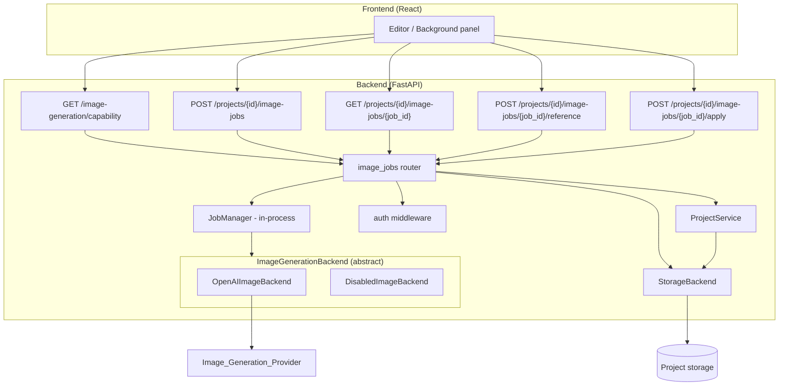
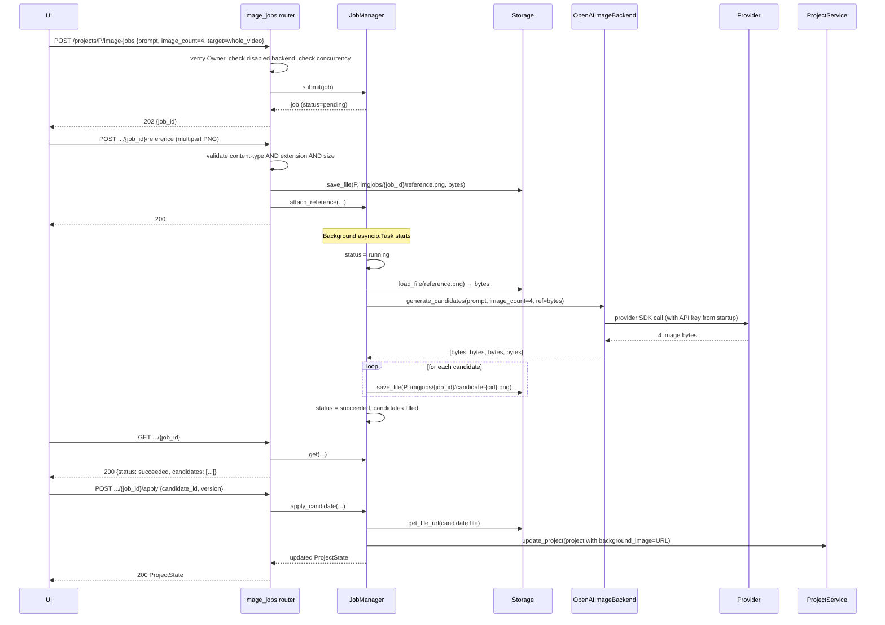

# Design Document: AI Background Generation

## Overview

This feature wires a real AI image-generation provider into the Story Video
Editor behind the existing `backend.models.image_gen.ImageGenerationBackend`
abstract interface, exposes async job submission and status endpoints, and
adds a reference-image upload path. The design preserves three constraints
that drive every decision below:

1. **Operator-provisioned secrets only.** The Image_Generation_Provider API
   key is read once at backend startup from environment configuration. It is
   never accepted from HTTP requests, never logged, and never returned in any
   response, including the capability endpoint.
2. **Single abstraction.** The new concrete provider adapter implements
   `ImageGenerationBackend.generate_single` and `generate_sectioned`. The
   HTTP routing layer depends only on the abstract interface; swapping or
   adding providers must not require route changes.
3. **Disabled fallback.** When no provider is configured at startup, a
   "disabled" implementation of `ImageGenerationBackend` is selected, so the
   router never has to special-case `None`. Calls into the disabled backend
   raise a typed error that the router translates to availability=false /
   503.

The feature lives entirely in the existing FastAPI process. Job state is
held in an in-process registry. No database, message queue, or external
worker is introduced.

### Key Design Decisions

- **In-process asyncio job registry.** Generation jobs are tracked in an
  `asyncio.Task`-backed dictionary in a `JobManager` singleton. State
  survives within a single backend process; cross-process durability is out
  of scope. Trade-off discussed in [Concurrency Model](#concurrency-model).
- **Provider selection at startup.** `IMAGE_GEN_PROVIDER` env var (e.g.
  `openai`, `none`) chooses the concrete adapter. The API key var name is
  provider-specific (e.g. `OPENAI_API_KEY`) and is read once. If the
  configured provider's key is missing or empty, the disabled backend is
  used.
- **Reference image lifetime tied to the job's candidates.** Reference
  images live under the Project's storage location next to the candidate
  images they produced. They are deleted when the job's candidates are
  deleted (per Requirement 2.6).
- **Section→image mapping lives on `ProjectState`.** A new optional
  `section_backgrounds` field maps `(start_index, end_index)` keys to
  candidate image URLs. The existing `background_image` remains the
  whole-video fallback (Requirement 3.6).
- **Capability endpoint is operator-opaque.** The capability response is a
  single boolean. No env var name, README pointer, provider name, or any
  operator-facing setup detail crosses the wire (Requirements 1.4, 1.7).

## Architecture



The router never holds a reference to a concrete provider type; it depends
on `ImageGenerationBackend`. At startup the dependency container picks
either `OpenAIImageBackend` (or future siblings) or `DisabledImageBackend`
based on `IMAGE_GEN_PROVIDER` and the presence of the matching API key.

## Components and Interfaces

### 1. Capability Endpoint

`GET /image-generation/capability`

Returns a single boolean. Authenticated (any logged-in Owner). Reads a
cached "is enabled" value computed once from the selected backend type at
startup, plus any per-session override flipped by an authentication failure
during a job (Requirement 5.5).

The endpoint MUST NOT include:
- the configured provider name,
- environment variable names (e.g. `OPENAI_API_KEY`),
- README references, configuration instructions, or links,
- error messages from the provider.

Response shape:

```json
{ "image_generation_enabled": true }
```

### 2. Image-Jobs Router (`backend/routers/image_jobs.py`)

Hosts the four job endpoints. Mounted at `/projects/{project_id}/image-jobs`.

All endpoints in this router:
- depend on `get_owner_id` from `backend/auth/middleware.py`,
- load the project via `ProjectService.get_project` and call
  `verify_project_ownership` (same pattern as `backend/routers/projects.py`),
- depend on the `ImageGenerationBackend` abstract type via FastAPI DI; they
  do not import any concrete adapter,
- never read or write the API key.

### 3. JobManager (`backend/services/image_job_service.py`)

A singleton service that:
- creates `GenerationJob` records,
- enforces the per-user concurrency cap,
- spawns an `asyncio.Task` per job that drives the backend and persists
  candidates,
- exposes `get_job(owner_id, job_id)` for the status endpoint, and
  `delete_job` for cleanup when candidates are deleted.

Job state lives in two `dict`s guarded by an `asyncio.Lock`:

```python
class JobManager:
    def __init__(self, ...):
        self._jobs: dict[str, GenerationJob] = {}            # job_id -> job
        self._running_per_owner: dict[str, set[str]] = {}    # owner_id -> {job_id}
        self._lock = asyncio.Lock()
        self._tasks: dict[str, asyncio.Task] = {}            # job_id -> task

    async def submit(self, owner_id, project, request) -> GenerationJob: ...
    async def get(self, owner_id, job_id) -> GenerationJob: ...
    async def attach_reference(self, owner_id, job_id, file) -> None: ...
    async def apply_candidate(self, owner_id, job_id, candidate_id) -> ProjectState: ...
    async def delete_job(self, owner_id, job_id) -> None: ...
```

Concurrency cap is enforced inside `submit` while the lock is held: if
`len(self._running_per_owner[owner_id]) >= MAX_CONCURRENT_IMAGE_JOBS_PER_USER`,
raise `ImageJobConcurrencyError`. The router maps this to 429.

### 4. Reference Image Upload Handler

A separate POST endpoint on the job (`/reference`) accepts a multipart
upload. The handler:
- validates the declared `Content-Type` is in `{image/png, image/jpeg}` AND
  the filename extension is in `{.png, .jpg, .jpeg}`. Both checks must
  pass (Requirement 9.3),
- enforces `MAX_REFERENCE_IMAGE_SIZE_MB` (default = `MAX_UPLOAD_SIZE_MB` =
  50 MB),
- stores the bytes via the existing `StorageBackend` under the project's
  storage location, with a job-scoped filename (see [Storage Layout](#storage-layout)),
- updates the in-memory job to record the reference path so the worker
  picks it up when it dispatches to the backend,
- can only be attached while the job is in `pending` state. After the job
  has started running, attaching a reference returns 409.

### 5. Provider Adapter (concrete `ImageGenerationBackend`)

The adapter implements `generate_single(prompt: str) -> bytes` and
`generate_sectioned(prompts: list[str]) -> list[bytes]`. To support
reference-image-guided and N-candidate generation without changing the
abstract class signature, the adapter accepts optional
adapter-specific keyword arguments via a small extension protocol on the
adapter, not on the abstract base:

```python
class ImageGenerationBackend(ABC):
    async def generate_single(self, prompt: str) -> bytes: ...
    async def generate_sectioned(self, prompts: list[str]) -> list[bytes]: ...

# Adapter-side extension. Not part of the abstract interface; kept on
# the concrete class. The job worker calls these directly.
class OpenAIImageBackend(ImageGenerationBackend):
    async def generate_candidates(
        self,
        prompt: str,
        *,
        image_count: int,
        reference_image_bytes: bytes | None,
    ) -> list[bytes]: ...

    async def generate_section_candidates(
        self,
        prompts: list[str],
        *,
        image_count: int,
        reference_image_bytes: bytes | None,
    ) -> list[list[bytes]]: ...
```

The two narrow methods (`generate_single`, `generate_sectioned`) on the
abstract base are preserved for backward compatibility (Requirement 8.1)
and can be expressed in terms of the candidate variants with
`image_count=1` and no reference. The router and JobManager use the
candidate variants via duck typing or a runtime `isinstance` check; the
disabled backend declines both.

### 6. Disabled Fallback (`DisabledImageBackend`)

```python
class ImageGenerationDisabledError(Exception): ...

class DisabledImageBackend(ImageGenerationBackend):
    async def generate_single(self, prompt: str) -> bytes:
        raise ImageGenerationDisabledError("Image generation is not configured")
    async def generate_sectioned(self, prompts: list[str]) -> list[bytes]:
        raise ImageGenerationDisabledError("Image generation is not configured")
```

The capability endpoint inspects the type of the bound backend (or a
`@property` `is_enabled` on the abstract type, defaulting `True`, overridden
to `False` on `DisabledImageBackend`) and returns the boolean.
`ImageGenerationDisabledError` is mapped by the router to 503 with a
generic message (Requirement 8.4).

### 7. Persistence Touchpoints

- All bytes (reference images, candidate images) flow through the existing
  `StorageBackend.save_file` interface — no new storage backend.
- Project state mutations (apply candidate) flow through
  `ProjectService.update_project` so optimistic concurrency, ownership, and
  timing validation remain centralized.
- Candidate URLs are obtained via `StorageBackend.get_file_url`, which on
  `LocalStorageBackend` produces `/projects/{project_id}/media/{filename}`.
  The existing `GET /projects/{id}/media/{filename}` route already serves
  these to the Owner only.

## Data Models

### Generation Job (in-memory)

```python
JobStatus = Literal["pending", "running", "succeeded", "failed"]
GenerationTargetKind = Literal["whole_video", "section"]

class GenerationTarget(BaseModel):
    kind: GenerationTargetKind
    start_index: int | None = None  # required when kind == "section"
    end_index: int | None = None    # required when kind == "section"

class CandidateImage(BaseModel):
    id: str            # uuid hex
    url: str           # served via existing /media route
    filename: str      # storage filename

class GenerationJob(BaseModel):
    id: str
    project_id: str
    owner_id: str
    prompt: str
    image_count: int
    target: GenerationTarget
    reference_image_filename: str | None = None
    status: JobStatus
    candidates: list[CandidateImage] = []
    error_message: str | None = None
    created_at: str
    updated_at: str
```

`GenerationJob` is **not** persisted to disk. If the backend process
restarts, in-flight jobs are lost; clients see 404 on subsequent status
calls and must resubmit. Already-applied candidates remain on disk and on
the Project state.

### Additions to `ProjectState`

```python
class SectionBackground(BaseModel):
    start_index: int
    end_index: int
    image_url: str

class ProjectState(BaseModel):
    # ...existing fields...
    background_image: str | None = None        # whole-video fallback
    section_backgrounds: list[SectionBackground] = []
```

`section_backgrounds` is the persistence point for Requirement 3.6. When
applying a candidate to a `section` target, the JobManager replaces any
existing entry that matches `(start_index, end_index)` and inserts the new
one. `background_image` is left untouched in the section flow so it remains
the fallback for sections without an assignment.

When applying a candidate to a `whole_video` target, only
`background_image` is updated; `section_backgrounds` is preserved
unchanged. The video assembly path (existing `pipeline/video.py`) is
out of scope for this spec — wiring `section_backgrounds` into the
assembled output is left as a separate task surfaced in
[Open Questions](#open-questions--out-of-scope).

### Storage Layout

Per project, under the existing `data/projects/{project_id}/` (or future
S3 prefix):

```
data/projects/{project_id}/
  state.json
  narration.mp3
  background.png                 # legacy whole-video upload
  imgjobs/
    {job_id}/
      reference.png|jpg          # optional reference image
      candidate-{candidate_id}.png  # one per candidate
```

`imgjobs/{job_id}/` keeps the job's blobs grouped so deleting the job is
one directory delete (out of scope for this iteration; see Open Questions).
File names use the existing `StorageBackend` API; the `imgjobs/...` prefix
is just a filename string passed to `save_file`.

## API Surface

All paths are owner-scoped via `verify_project_ownership` unless noted.
Authentication uses the existing `get_owner_id` dependency.

### `GET /image-generation/capability`

Auth: required.
Owner-scoped: no (per-deployment fact, not per-project).

Response 200:
```json
{ "image_generation_enabled": true }
```

No other fields. Never includes provider names, env var names, or setup
instructions.

### `POST /projects/{project_id}/image-jobs`

Auth: required, must be project Owner.

Request body:
```json
{
  "prompt": "a moonlit forest with fog",
  "image_count": 4,
  "target": {
    "kind": "section",
    "start_index": 3,
    "end_index": 7
  }
}
```

`image_count` is optional; defaults to 1. Must be in
`[1, MAX_IMAGES_PER_JOB]`. `target.kind` is `"whole_video"` or `"section"`.
For `whole_video`, `start_index` and `end_index` MUST be omitted or null.
For `section`, both indices are required, must satisfy
`0 <= start_index <= end_index < len(project.subtitles)`, and the project
must have at least one subtitle.

Response 202:
```json
{
  "job_id": "a8c7e30b-...",
  "status": "pending"
}
```

Status codes:
| Code | Cause |
| --- | --- |
| 202 | Job accepted |
| 401 | Missing/invalid bearer token |
| 403 | Caller is not the project Owner |
| 404 | Project not found |
| 422 | Invalid `image_count`, invalid section indices, no subtitles for section target |
| 429 | `MAX_CONCURRENT_IMAGE_JOBS_PER_USER` exceeded |
| 503 | Backend is the disabled fallback |

### `POST /projects/{project_id}/image-jobs/{job_id}/reference`

Auth: required, must be Owner of the job's project. Job must exist and be
in `pending` state.

Request: `multipart/form-data` with field `file`.

Validation:
- `Content-Type` ∈ {`image/png`, `image/jpeg`} AND extension ∈
  {`.png`, `.jpg`, `.jpeg`} (Requirement 9.3).
- Body size ≤ `MAX_REFERENCE_IMAGE_SIZE_MB` MB.

Response 200:
```json
{ "detail": "Reference image attached" }
```

Status codes:
| Code | Cause |
| --- | --- |
| 200 | Reference attached |
| 401 / 403 / 404 | Auth / ownership / not-found |
| 409 | Job is no longer in `pending` state |
| 413 | File exceeds `MAX_REFERENCE_IMAGE_SIZE_MB` |
| 422 | Wrong content type or extension |

### `GET /projects/{project_id}/image-jobs/{job_id}`

Auth: required, must be Owner.

Response 200 (succeeded example):
```json
{
  "id": "a8c7e30b-...",
  "status": "succeeded",
  "image_count": 4,
  "target": { "kind": "whole_video" },
  "candidates": [
    { "id": "c1", "url": "/projects/{pid}/media/imgjobs/{job_id}/candidate-c1.png" },
    { "id": "c2", "url": "/projects/{pid}/media/imgjobs/{job_id}/candidate-c2.png" }
  ],
  "error_message": null,
  "created_at": "...",
  "updated_at": "..."
}
```

For `failed`, `candidates` is `[]` and `error_message` carries a
user-friendly string with no provider stack trace, no API key, no env var
names (Requirement 5.4).

Status codes: 200 / 401 / 403 / 404.

### `POST /projects/{project_id}/image-jobs/{job_id}/apply`

Auth: required, must be Owner. Job must be `succeeded`.

Request body:
```json
{ "candidate_id": "c2", "version": 7 }
```

`version` is the project's current `version` for the existing optimistic
concurrency check.

Effect:
- `whole_video` target: sets `project.background_image` to the candidate's
  URL.
- `section` target: upserts a `SectionBackground` entry with the job's
  `(start_index, end_index)` and the candidate's URL into
  `project.section_backgrounds`. `background_image` is unchanged.

Response 200: returns the updated `ProjectState`.

Status codes:
| Code | Cause |
| --- | --- |
| 200 | Applied |
| 401 / 403 / 404 | Auth / ownership / not-found |
| 409 | `version` mismatch |
| 422 | `candidate_id` not in this job |

## Sequence Diagrams

### (a) Whole-video generation with reference image — happy path



### (b) Section generation — happy path

```mermaid
sequenceDiagram
    participant UI
    participant Router as image_jobs router
    participant JobMgr as JobManager
    participant Adapter as OpenAIImageBackend

    UI->>Router: POST /projects/P/image-jobs {prompt, image_count=2, target={section, 3, 7}}
    Router->>Router: verify Owner; check subtitles non-empty; check 0<=3<=7<len(subs)
    Router->>JobMgr: submit(job)
    Router-->>UI: 202 {job_id}

    Note over JobMgr: Background task
    JobMgr->>Adapter: generate_candidates(prompt, image_count=2, ref=None)
    Adapter-->>JobMgr: [bytes, bytes]
    JobMgr->>JobMgr: persist candidates, status=succeeded

    UI->>Router: GET .../{job_id} → succeeded
    UI->>Router: POST .../{job_id}/apply {candidate_id, version}
    JobMgr->>ProjectService: update_project(project with section_backgrounds upserted)
    Router-->>UI: 200 ProjectState (background_image unchanged)
```

## Concurrency Model

### Where the work runs

Each accepted job spawns an `asyncio.Task` via `asyncio.create_task`,
captured in `JobManager._tasks[job_id]`. The task is awaited by the
JobManager during shutdown to a best-effort cancellation; clients are not
guaranteed completion across restarts.

We considered three options:

| Option | Pros | Cons |
| --- | --- | --- |
| `BackgroundTasks` from FastAPI | simple, in-line with existing pipeline endpoints | tied to a single request; no way to query state; awkward for status polling |
| **In-process `asyncio` task registry** (chosen) | clean job model, fits status endpoint, no new infra | not durable across process restarts |
| External worker (e.g. Celery, RQ) + Redis | durable, horizontally scalable | new infra, deployment burden, overkill for current scale |

The in-process registry matches existing `PipelineService` patterns
(`_running` dict guarded by `asyncio.Lock`) and the requirements explicitly
scope cross-process durability as out of scope.

### Per-user concurrency cap

`MAX_CONCURRENT_IMAGE_JOBS_PER_USER` (default 2) is enforced inside
`JobManager.submit` while holding `self._lock`:

```python
async def submit(self, owner_id, ...):
    async with self._lock:
        running = self._running_per_owner.setdefault(owner_id, set())
        if len(running) >= self.settings.MAX_CONCURRENT_IMAGE_JOBS_PER_USER:
            raise ImageJobConcurrencyError(...)
        job = self._make_job(...)
        running.add(job.id)
        self._jobs[job.id] = job
    self._tasks[job.id] = asyncio.create_task(self._run_job(job))
    return job
```

The slot is released in a `finally` block in `_run_job`, after status is
flipped to `succeeded` or `failed`. Acquisition and release are both under
the lock so a burst of submissions cannot bypass the cap.

### Status reads

`get_job` is a simple lock-free dict lookup followed by an ownership check.
Consistency between `status` and `candidates` is preserved by always
mutating the `GenerationJob` Pydantic instance under the lock and never
exposing partial states; transitions are: `pending → running → succeeded |
failed`.

## Configuration

Operator-facing environment variables. **All are documented here for
operators; none are surfaced to end users in any HTTP response, log line,
or UI string.**

| Variable | Type | Default | Purpose |
| --- | --- | --- | --- |
| `IMAGE_GEN_PROVIDER` | str | unset / `none` | Selects provider adapter at startup. `none` (or unset) selects `DisabledImageBackend`. |
| `OPENAI_API_KEY` (or analogous per provider) | str (secret) | unset | Provider credential. Read once at startup. Never logged. Never returned. |
| `MAX_IMAGES_PER_JOB` | int | 4 | Upper bound on candidate count per job (Requirement 4). |
| `MAX_CONCURRENT_IMAGE_JOBS_PER_USER` | int | 2 | Per-user concurrent generation cap (Requirement 7). |
| `MAX_REFERENCE_IMAGE_SIZE_MB` | int | value of `MAX_UPLOAD_SIZE_MB` (50) | Max reference image upload size (Requirement 2.2). |

Startup logic (in `backend/dependencies.py`):

```python
def _build_image_backend(settings) -> ImageGenerationBackend:
    provider = (os.getenv("IMAGE_GEN_PROVIDER") or "").strip().lower()
    if provider == "openai":
        key = os.getenv("OPENAI_API_KEY") or ""
        if key:
            return OpenAIImageBackend(api_key=key)
    return DisabledImageBackend()
```

Logging discipline: at startup the system logs only `image_generation
enabled=<bool>`; never the key, never the var name when disabled.

## Error Handling

### HTTP status code mapping

| Condition | Status | Response detail |
| --- | --- | --- |
| Backend disabled, job submission attempted | 503 | "AI background generation is currently unavailable" |
| Concurrency cap exceeded | 429 | "You already have N image-generation jobs running. Wait for one to finish." |
| `image_count` out of range | 422 | "image_count must be between 1 and {MAX_IMAGES_PER_JOB}" |
| `section` target with no subtitles | 422 | "Subtitles must be generated before requesting a section background" |
| `section` target with bad indices | 422 | "Invalid section indices" |
| Reference upload wrong format | 422 | "Only PNG and JPEG reference images are accepted" |
| Reference upload over size limit | 413 | "Reference image exceeds {MAX_REFERENCE_IMAGE_SIZE_MB} MB" |
| Reference attached after job started | 409 | "Reference image must be attached before the job starts running" |
| Apply with bad `candidate_id` | 422 | "Unknown candidate" |
| Apply with stale `version` | 409 | reused from existing optimistic concurrency mapping |
| Job not found | 404 | "Job not found" |
| Caller not Owner | 403 | reused from `verify_project_ownership` |
| Generic provider failure | job → `failed` | Generic message in `error_message`; HTTP for status read remains 200 |
| Provider authentication failure | job → `failed` AND capability flips for session | Generic message; capability endpoint returns `false` for the rest of the page session |

### What never appears in any response or log

- The API key value, in any form (full, masked, or prefix).
- The configured environment variable names.
- Provider-specific error codes or stack traces.
- Provider product names in user-facing strings.

The backend logs provider failures at WARN level with the job id and a
sanitized error category (e.g. `auth_failed`, `rate_limited`, `unknown`),
not the raw provider error.

### Capability flip on auth failure (Requirement 5.5)

`OpenAIImageBackend` raises a typed `ProviderAuthenticationError` for
401/403 responses from the provider. The JobManager catches it, marks the
job `failed` with a generic message, and calls
`capability_state.disable_for_session()` which sets a process-level flag.
The capability endpoint reads `capability_state.enabled and
backend_is_not_disabled()`. Subsequent capability calls return `false`
until the process restarts (so an operator key rotation re-enables the
feature on next deployment).

## Frontend Contract (Brief)

The backend changes drive these frontend contracts:

- **Capability response shape:** `{ image_generation_enabled: bool }`. The
  frontend caches this for the page session and disables the generation
  controls when `false`. UI must NOT display any operator setup hints,
  environment variable names, or provider names.
- **Submit form fields:** `prompt` (string, required),
  `image_count` (int, defaults to 1, capped client-side at the
  capability-reported max once that field exists; for now hardcode to 4
  matching the backend default), `target.kind`
  (`"whole_video"` | `"section"`), and for `section`,
  `target.start_index` / `target.end_index` (subtitle list indices).
- **Reference upload:** separate POST after job creation, multipart, field
  name `file`. Frontend must restrict the picker to PNG/JPEG and
  client-side check `MAX_REFERENCE_IMAGE_SIZE_MB`-style bound (a
  conservative 50 MB) before upload.
- **Status polling cadence:** poll `GET .../{job_id}` every 2 seconds while
  the status is `pending` or `running`. Stop polling on `succeeded` or
  `failed`. (No SSE for image jobs in this iteration; the existing SSE
  helper is reserved for the pipeline.)
- **Apply candidate:** uses the project's current `version` for optimistic
  concurrency, mirroring the existing PUT `/projects/{id}` flow.

The frontend MUST flip its in-memory `image_generation_enabled` to `false`
on a `failed` job whose `error_message` indicates the generic
"unavailable" string (or, equivalently, on the next capability poll), so
the controls disable for the rest of the page session.


## Correctness Properties

*A property is a characteristic or behavior that should hold true across all
valid executions of a system — essentially, a formal statement about what
the system should do. Properties serve as the bridge between human-readable
specifications and machine-verifiable correctness guarantees.*

### Property 1: Capability and error responses are operator-opaque

*For any* request to `GET /image-generation/capability`, and *for any*
response body produced by the image-jobs router (job submission, job
status including failed jobs, reference upload errors), the JSON payload
SHALL NOT contain any of these forbidden substrings (case-insensitive):
the configured provider's API key value, any environment variable name
this feature reads (e.g. `IMAGE_GEN_PROVIDER`, `OPENAI_API_KEY`,
`MAX_IMAGES_PER_JOB`, `MAX_CONCURRENT_IMAGE_JOBS_PER_USER`,
`MAX_REFERENCE_IMAGE_SIZE_MB`), the literal string "API key", the literal
string "README", or a Python traceback frame marker (`Traceback`,
`File "`).

**Validates: Requirements 1.4, 1.7, 5.4**

### Property 2: Reference image upload validation

*For any* tuple `(content_type, filename_extension, byte_size)` submitted
to `POST /projects/{id}/image-jobs/{job_id}/reference`, the upload SHALL
be accepted (200) if and only if:
`content_type ∈ {"image/png", "image/jpeg"}` AND
`filename_extension ∈ {".png", ".jpg", ".jpeg"}` AND
`byte_size ≤ MAX_REFERENCE_IMAGE_SIZE_MB × 1024 × 1024`.
When the type/extension check fails the response SHALL be 422; when only
the size check fails the response SHALL be 413.

**Validates: Requirements 2.2, 2.3, 9.3**

### Property 3: Section target index validation

*For any* triple `(subtitles_len, start_index, end_index)` submitted as a
`section` Generation_Target, the job SHALL be accepted if and only if
`subtitles_len > 0` AND `0 ≤ start_index ≤ end_index < subtitles_len`.
Otherwise the response SHALL be 422.

**Validates: Requirements 3.2, 3.3, 3.4**

### Property 4: image_count range validation

*For any* integer `image_count` value submitted (or omitted), the job SHALL
be accepted if and only if `1 ≤ image_count ≤ MAX_IMAGES_PER_JOB` (with
omitted treated as 1). Otherwise the response SHALL be 422.

**Validates: Requirements 4.1, 4.3 (and 4.2 as the omitted-default case)**

### Property 5: Successful job candidates and apply semantics

*For any* Generation_Job J that reaches `succeeded` with `image_count = n`:
1. `len(J.candidates) == n` and every candidate has a URL served by the
   existing project media route.
2. Applying any candidate `c` of J to a `whole_video` target sets
   `project.background_image = c.url` and leaves `project.section_backgrounds`
   unchanged.
3. Applying any candidate `c` of J to a `section` target with
   `(start_index, end_index)` upserts a `SectionBackground{start_index,
   end_index, image_url=c.url}` entry into `project.section_backgrounds`
   and leaves `project.background_image` unchanged.

**Validates: Requirements 3.5, 3.6, 4.4, 5.3**

### Property 6: Ownership enforcement on all job-scoped routes

*For any* authenticated caller `U` and *for any* project `P` whose owner
is not `U`, every call by `U` to any of the following routes SHALL return
403, regardless of body content: `POST /projects/{P}/image-jobs`, `POST
/projects/{P}/image-jobs/{job_id}/reference`, `GET
/projects/{P}/image-jobs/{job_id}`, `POST
/projects/{P}/image-jobs/{job_id}/apply`, and `GET
/projects/{P}/media/{any_imgjobs_filename}`.

**Validates: Requirements 6.1, 6.2, 6.3, 9.4, 9.5**

### Property 7: Per-user concurrency cap is honored

*For any* sequence of submit and terminate operations for a single
`owner_id`, at every moment the number of jobs in `pending` or `running`
state for that owner SHALL be at most `MAX_CONCURRENT_IMAGE_JOBS_PER_USER`.
A submission that would exceed the cap SHALL return 429. After any job
reaches `succeeded` or `failed`, a new submission within the cap SHALL be
accepted.

**Validates: Requirements 7.2, 7.3**

### Property 8: Disabled backend declines all generation calls

*For any* call into the bound `ImageGenerationBackend` when it is the
`DisabledImageBackend` instance — including `generate_single`,
`generate_sectioned`, and the adapter-side candidate methods used by the
worker — the call SHALL raise `ImageGenerationDisabledError`. The router
SHALL map this error to 503 with a generic message.

**Validates: Requirements 8.2, 8.4**

### Property 9: Job submission shape

*For any* valid Generation_Job request submitted by the project Owner with
the bound backend enabled, the response status code SHALL be 202 and the
body SHALL contain a non-empty `job_id` string. The same `job_id` SHALL
subsequently resolve via `GET .../image-jobs/{job_id}` to a job whose
`owner_id` matches the caller and whose `project_id` matches the path
parameter.

**Validates: Requirement 5.1**

### Property 10: Provider auth failure flips capability for the session (example)

After a Generation_Job fails due to a provider authentication error, a
subsequent call to `GET /image-generation/capability` SHALL return
`{"image_generation_enabled": false}` for the remainder of the process
lifetime, even if the underlying backend type is enabled.

**Validates: Requirement 5.5**

## Testing Strategy

### Frameworks

- **Backend**: `pytest` with `hypothesis` for property-based tests, `httpx`
  for async API tests (matching the existing `backend/tests/` setup).
- A fake `ImageGenerationBackend` (`FakeImageBackend`) is used for tests
  that need a "configured" backend without calling a real provider. The
  fake records inputs and returns deterministic byte payloads for
  candidates.

Property-based tests are configured to run a minimum of 100 iterations per
property (`@settings(max_examples=100)`).

### Mapping properties to tests

Each property in the previous section maps to a single property-based
test. Test docstrings are tagged with the format
**Feature: ai-background-generation, Property N: {property_text}** so
property → test traceability is grep-able.

| Property | Test file (proposed) | What's randomized |
| --- | --- | --- |
| 1 | `test_image_jobs_response_safety.py` | Mix of capability, valid submit, invalid submit, failed-job responses |
| 2 | `test_image_jobs_reference_upload.py` | (content_type, extension, byte_size) tuples |
| 3 | `test_image_jobs_section_validation.py` | (subtitles_len, start, end) triples |
| 4 | `test_image_jobs_image_count.py` | image_count integers across full int range |
| 5 | `test_image_jobs_apply.py` | (image_count, target_kind, candidate_id, indices) |
| 6 | `test_image_jobs_authorization.py` | (project_owner, caller, route) where owner ≠ caller |
| 7 | `test_image_jobs_concurrency.py` | Sequences of submit/terminate operations for one owner |
| 8 | `test_image_backend_disabled.py` | Method invocations on the disabled backend |
| 9 | `test_image_jobs_submit_shape.py` | Valid request bodies |
| 10 | `test_image_jobs_capability.py` | One scripted scenario, not randomized |

### Unit tests (complementary)

Unit tests handle the targeted examples called out as `yes - example` or
`edge-case` in the prework, plus integration glue:

- `IMAGE_GEN_PROVIDER` env-var → backend selection (one example per
  configuration: unset, `none`, `openai` with key, `openai` without key).
- Default `image_count` of 1 when the field is omitted.
- ABC enforcement: `DisabledImageBackend()` instantiates and is an
  `isinstance(backend, ImageGenerationBackend)`.
- Reference image attachment after job started returns 409.
- A single example asserting log capture during a failed job contains no
  API key value, no env var name (Requirement 9.2).
- A single example asserting that a request body containing a
  `provider_api_key` field has no effect on backend behavior
  (Requirement 9.1).

### Property-based test configuration

- All property tests live in `backend/tests/test_image_jobs_*.py`.
- Hypothesis profile uses `derandomize=False`, `max_examples=100`.
- Each property test docstring carries the **Feature:**/**Property N:**
  tag.
- The `FakeImageBackend` is wired via the existing FastAPI dependency
  override mechanism so tests don't require a real provider key.

### What is intentionally not property-tested

- Frontend caching behavior of the capability response (Requirement 1.5,
  1.6) — covered separately in frontend tests.
- The architectural rule that the router does not import a concrete
  provider (Requirement 8.3) — enforced by code review and a static
  import-check unit test, not a property.
- Cross-process job durability — out of scope by design.

## Open Questions / Out of Scope

1. **Section background rendering.** This spec wires section→image
   assignments into `ProjectState.section_backgrounds`. Updating the
   video assembly path (`backend/pipeline/video.py` /
   `create_video_with_subtitles`) to actually render those per-section
   images during export is out of scope here and should be a follow-up
   spec. Until then, applied section backgrounds are visible in state but
   the exported video continues to use `background_image` only.

2. **Job/candidate cleanup endpoint.** Requirement 2.6 says reference
   image bytes are deleted when candidates are deleted. There is no
   "delete candidates" endpoint in this spec; project deletion already
   removes the entire project directory (including `imgjobs/`). A future
   "delete job" endpoint would need to clean both reference and
   candidates atomically.

3. **Cross-process durability.** Job state is in-process. A backend
   restart loses in-flight jobs. Documented in [Concurrency Model](#concurrency-model)
   and Requirement scope.

4. **Provider selection.** This design names `openai` as the example
   adapter. Choice of the actual provider and its API surface is left to
   implementation. Adding a second provider should require only a new
   adapter class plus an `IMAGE_GEN_PROVIDER` value, with no router
   changes.

5. **Capability endpoint and per-user state.** The "auth failure flips
   capability for the session" rule (Requirement 5.5) is currently
   process-wide rather than truly per-page-session, since the backend has
   no notion of a frontend session. Per-session scoping is left to the
   frontend cache. The backend just guarantees that once a provider auth
   error has been observed, capability returns `false` until the process
   restarts.
