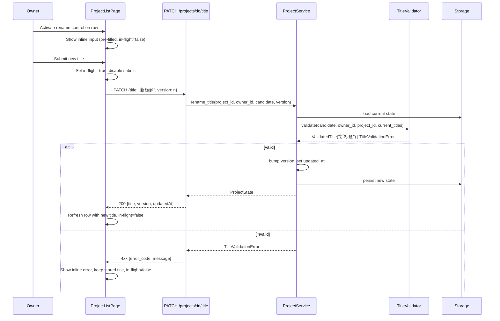

# Design Document: Project Titles

## Overview

This feature gives Owners explicit, validated control over Project titles. Today the backend auto-generates a Title from the first 50 characters of `story_text` whenever the client omits one, and there is no uniqueness or validation logic beyond Pydantic's default string handling. This design:

1. Introduces a single `Title_Validator` component on the backend that owns trimming, length, character-class, and per-owner uniqueness checks.
2. Makes `title` a required field on the project-creation request, removes the auto-generation fallback, and routes both create and rename through the same validator.
3. Adds a dedicated rename endpoint (`PATCH /projects/{id}/title`) so the projects list page can rename without sending the full project state, and so the validator's error responses can stay narrowly scoped to title problems.
4. Adds an in-place rename control on the projects list page, including an in-flight guard so the same project cannot be renamed twice concurrently.
5. Preserves stored Titles for pre-existing projects as-is (including titles previously auto-generated and any incidental duplicates), and treats them as ordinary user-editable Titles thereafter.

### Key Design Decisions

1. **Validator as a pure function, uniqueness as a separate check.** Trim/length/character validation is a pure function over a candidate string. Uniqueness requires reading other projects under the same owner, so it lives behind an injected lookup. Keeping these separated lets us property-test the pure rules exhaustively without storage fixtures.

2. **Dedicated `PATCH /projects/{id}/title` endpoint instead of overloading `PUT /projects/{id}`.** The existing `PUT /projects/{id}` accepts a full `ProjectState` body and does timing validation. A rename-only endpoint keeps the rename request payload minimal (`{title, version}`), gives a focused error response shape for title problems, and lets the projects list page rename without round-tripping the full state. `PUT` continues to accept any `title` field but routes the value through the same validator so the editor cannot bypass the rules.

3. **Case-insensitive uniqueness via Unicode casefold on trimmed value.** Python's `str.casefold()` correctly normalizes Latin and most non-Latin scripts. For Chinese, casefold is a no-op (Han characters have no case), which matches the requirement's intent. We compare the casefolded trimmed Titles and never store the casefolded form — the original user-typed Title is preserved.

4. **Owner-scoped uniqueness backed by directory scan, mirroring `_count_user_projects`.** The current `ProjectService` already iterates `data/projects/*/state.json` for listing and counting under the local backend. Uniqueness reuses the same pattern, scoped to the calling owner. When we move to a database, this lookup becomes a single query.

5. **Validate-then-write race window is acceptable.** Two simultaneous create/rename requests by the same owner with identical Titles can both pass the uniqueness check before either persists. We accept this race because: (a) the local filesystem backend is single-process under the dev server; (b) the per-user concurrency cap (`MAX_CONCURRENT_PIPELINES_PER_USER=2`) and per-user project cap make the race rare; (c) database deployments will gain a unique index on `(owner_id, lower(trim(title)))` which closes the race at the storage layer. The design does not introduce a backend-side lock for this.

6. **Pre-existing duplicates are tolerated, not auto-resolved.** Per Requirement 5.4 we never silently rename a stored Title. Uniqueness checks apply only to *candidate* Titles being written, comparing against currently-stored Titles. A project's own current Title is excluded from the comparison so a no-op rename always succeeds (Requirement 3.4).

7. **Auto-generation fallback removed entirely.** The `title or story_text[:50]` fallback in `ProjectService.create_project` is deleted. The router-level Pydantic schema makes `title` required, so the service can assume a non-`None` Title.

## Architecture

```mermaid
graph TB
    subgraph Frontend ["Frontend (React)"]
        Create[CreateProjectPage]
        List[ProjectListPage]
        RenameControl[InlineRenameControl]
        ApiClient[api/projects.ts]
    end

    subgraph Backend ["Backend (FastAPI)"]
        Router[routers/projects.py]
        Service[services/project_service.py]
        Validator[services/title_validator.py]
        Storage[persistence/local.py]
    end

    Create -->|POST /projects {title,...}| Router
    List --> RenameControl
    RenameControl -->|PATCH /projects/:id/title| Router
    Create --> ApiClient
    List --> ApiClient
    ApiClient --> Router

    Router --> Service
    Service --> Validator
    Service --> Storage
    Validator -.reads owner's titles via.-> Service
```

### Rename Request Flow



## Components and Interfaces

### Backend: `Title_Validator`

New module: `backend/services/title_validator.py`.

```python
from dataclasses import dataclass
from enum import Enum
import unicodedata

MAX_TITLE_LENGTH = 100

class TitleErrorCode(str, Enum):
    REQUIRED = "title_required"
    EMPTY = "title_empty"
    TOO_LONG = "title_too_long"
    CONTROL_CHARS = "title_control_chars"
    DUPLICATE = "title_duplicate"

@dataclass
class TitleValidationError(Exception):
    code: TitleErrorCode
    message: str

def normalize(candidate: str) -> str:
    """Trim leading and trailing whitespace. No other transformation."""
    return candidate.strip()

def validate_shape(candidate: str | None) -> str:
    """Apply Requirement 4 rules. Returns the trimmed title or raises."""
    if candidate is None:
        raise TitleValidationError(TitleErrorCode.REQUIRED, "Title is required.")
    trimmed = normalize(candidate)
    if len(trimmed) == 0:
        raise TitleValidationError(TitleErrorCode.EMPTY, "Title must not be empty.")
    if len(trimmed) > MAX_TITLE_LENGTH:
        raise TitleValidationError(
            TitleErrorCode.TOO_LONG,
            f"Title must be at most {MAX_TITLE_LENGTH} characters.",
        )
    for ch in trimmed:
        if unicodedata.category(ch) == "Cc":
            raise TitleValidationError(
                TitleErrorCode.CONTROL_CHARS,
                "Title must not contain control characters.",
            )
    return trimmed

def title_key(trimmed: str) -> str:
    """Comparison key for uniqueness: casefolded, trimmed."""
    return trimmed.casefold()

def check_uniqueness(
    trimmed: str,
    *,
    self_project_id: str | None,
    siblings: list[tuple[str, str]],  # (project_id, stored_title)
) -> None:
    """Raise DUPLICATE if any sibling shares the same title key, excluding self."""
    candidate_key = title_key(trimmed)
    for pid, stored in siblings:
        if pid == self_project_id:
            continue
        if title_key(normalize(stored)) == candidate_key:
            raise TitleValidationError(
                TitleErrorCode.DUPLICATE,
                "A project with this title already exists.",
            )
```

`validate_shape` covers Requirement 4 in isolation. `check_uniqueness` covers Requirement 3, taking the siblings list as input so the function stays pure and testable. Length is measured in Unicode code points (Python `len(str)`), which matches user expectation for CJK content where each Han character is one code point.

### Backend: `ProjectService` changes

Add two helpers and one new operation; remove the auto-generation fallback.

```python
# backend/services/project_service.py

class TitleConflictError(ProjectServiceError):
    """Raised when a candidate title duplicates an existing owner-scoped title."""

class ProjectService:
    async def _list_owner_titles(self, owner_id: str) -> list[tuple[str, str]]:
        """Return [(project_id, stored_title)] for every project owned by owner_id."""
        # Mirrors the directory scan in _count_user_projects / list_projects.

    async def create_project(
        self,
        story_text: str,
        owner_id: str,
        title: str,                       # now required, no default
        voice: str = "zh-CN-XiaoxiaoNeural",
    ) -> ProjectState:
        # 1. enforce MAX_PROJECTS_PER_USER (existing)
        # 2. trimmed = title_validator.validate_shape(title)
        # 3. siblings = await self._list_owner_titles(owner_id)
        # 4. title_validator.check_uniqueness(trimmed, self_project_id=None, siblings=siblings)
        # 5. persist state with title=trimmed
        ...

    async def rename_title(
        self,
        project_id: str,
        owner_id: str,
        candidate: str,
        expected_version: int,
    ) -> ProjectState:
        current = await self._load_state(project_id)
        if current.owner_id != owner_id:
            raise ProjectNotFoundError(project_id)  # caller maps to 404
        if current.version != expected_version:
            raise VersionConflictError(...)
        trimmed = title_validator.validate_shape(candidate)
        siblings = await self._list_owner_titles(owner_id)
        title_validator.check_uniqueness(
            trimmed, self_project_id=project_id, siblings=siblings
        )
        current.title = trimmed
        current.version += 1
        current.updated_at = datetime.now(timezone.utc).isoformat()
        await self._save_state(current)
        return current
```

`update_project` (PUT) is amended so that if the incoming `title` differs from the stored Title, the same `validate_shape` + `check_uniqueness` pair runs. This prevents the editor from sneaking an invalid title past the validator via a full-state PUT.

### Backend: API surface

| Endpoint | Method | Body | Success | Errors |
|---|---|---|---|---|
| `/projects` | POST | `{title: str, story_text: str, voice?: str}` (title required) | 201 `ProjectState` | 400 missing field, 422 invalid title, 409 duplicate, 429 over limit |
| `/projects/{id}/title` | PATCH | `{title: str, version: int}` | 200 `ProjectState` | 404 not owned/missing, 409 duplicate or version conflict, 422 invalid title |
| `/projects/{id}` | PUT | full `ProjectState` | 200 `ProjectState` | 422 timing or invalid title, 409 version conflict or duplicate title |

`CreateProjectRequest` becomes:

```python
class CreateProjectRequest(BaseModel):
    title: str            # required, no default
    story_text: str
    voice: str = "zh-CN-XiaoxiaoNeural"

    @field_validator("story_text")
    @classmethod
    def story_text_not_blank(cls, v: str) -> str: ...
```

A new `RenameTitleRequest`:

```python
class RenameTitleRequest(BaseModel):
    title: str
    version: int
```

### Backend: Error response shape

A small consistency fix: title-specific errors return a structured body so the frontend can show field-targeted messages without parsing strings.

```json
{
  "detail": {
    "error_code": "title_duplicate",
    "field": "title",
    "message": "A project with this title already exists."
  }
}
```

Status code mapping:

| `TitleErrorCode` | HTTP status |
|---|---|
| `title_required` | 422 |
| `title_empty` | 422 |
| `title_too_long` | 422 |
| `title_control_chars` | 422 |
| `title_duplicate` | 409 |

Pydantic's own missing-field error for the create payload (when `title` is omitted entirely) maps to 422 and FastAPI's default location-pointer body — the frontend treats this the same as `title_required`.

### Frontend: API client (`frontend/src/api/projects.ts`)

```typescript
export async function createProject(
  storyText: string,
  title: string,                  // now required
  voice?: string,
): Promise<Project> { ... }

export async function renameProject(
  id: string,
  title: string,
  version: number,
): Promise<Project> {
  const { data } = await apiClient.patch<Project>(
    `/projects/${id}/title`,
    { title, version },
  );
  return data;
}
```

Existing `updateProject` is unchanged.

### Frontend: `CreateProjectPage`

- Adds a required `<input>` for Title above the story textarea.
- Local validation mirrors the backend rules (trim, 1–100, no `Cc` chars) so the user gets immediate feedback. The backend remains the source of truth: server errors are rendered field-targeted next to the input.
- Submit is disabled while the title field is blank or local validation fails.
- The existing story-text validation behavior is preserved.

### Frontend: `ProjectListPage` rename control

Each project card gains a rename affordance (a pencil icon button) next to the title. Activating it swaps the title text for an `<input>` pre-filled with the current Title and a Save / Cancel pair.

State model per row:

```typescript
type RenameState =
  | { mode: "idle" }
  | { mode: "editing"; draft: string }
  | { mode: "submitting"; draft: string }
  | { mode: "error"; draft: string; message: string };
```

In-flight guard (Requirement 2.4): while `mode === "submitting"` the Save button is disabled and Enter does nothing. Each row's rename state is independent, so other rows remain editable concurrently.

On success the row is updated with the returned `title`, `version`, and `updatedAt`, then `mode` returns to `idle`. On `409` due to version conflict the row reloads its summary from `listProjects` and re-enters `editing` with the latest version. On other errors (`422`, `409 duplicate`) the inline error message is shown and the input stays open with the user's draft preserved.

## Data Models

### Backend

`ProjectState.title` remains `str` (no schema change). The model already enforces `title` as required at the type level — the change is removing the service-layer fallback that papered over missing titles.

### Frontend

`Project.title` and `ProjectSummary.title` are unchanged. The `createProject` signature changes from `(storyText, voice?, title?)` to `(storyText, title, voice?)`, making `title` required at the type level. Call sites that don't pass a Title become a TypeScript build error.

### Validation Constants

| Constant | Value | Source of truth |
|---|---|---|
| `MAX_TITLE_LENGTH` | 100 (Unicode code points) | `backend/services/title_validator.py` |
| Allowed character classes | All Unicode except category `Cc` | same |
| Comparison key for uniqueness | `title.strip().casefold()` | same |

The frontend mirrors these constants in a single module (`frontend/src/lib/titleValidation.ts`) so client-side previews stay in sync.


## Correctness Properties

*A property is a characteristic or behavior that should hold true across all valid executions of a system — essentially, a formal statement about what the system should do. Properties serve as the bridge between human-readable specifications and machine-verifiable correctness guarantees.*

### Property 1: Valid titles are accepted and trimmed

*For any* string `s` whose `s.strip()` has length between 1 and 100 inclusive and contains no characters in Unicode category `Cc`, `validate_shape(s)` returns `s.strip()` without raising. The returned value equals the input with only leading/trailing whitespace removed; no other transformation is applied.

**Validates: Requirements 1.1, 4.1, 4.5**

### Property 2: Empty or whitespace-only titles are rejected

*For any* string `s` whose `s.strip()` has length 0 (including the empty string and any combination of Unicode whitespace characters), `validate_shape(s)` raises `TitleValidationError` with code `title_empty` (or `title_required` when `s is None`).

**Validates: Requirements 1.3, 4.2, 1.2**

### Property 3: Over-length titles are rejected

*For any* string `s` whose `s.strip()` has length strictly greater than 100 Unicode code points, `validate_shape(s)` raises `TitleValidationError` with code `title_too_long`.

**Validates: Requirements 4.3**

### Property 4: Control characters are rejected

*For any* string `s` such that `s.strip()` contains at least one character whose Unicode category is `Cc`, `validate_shape(s)` raises `TitleValidationError` with code `title_control_chars`.

**Validates: Requirements 4.4**

### Property 5: Title comparison key is trim-and-casefold

*For any* pair of strings `s` and `t`, `title_key(s.strip()) == title_key(t.strip())` if and only if `s.strip().casefold() == t.strip().casefold()`. Equivalently, the comparison the validator uses for uniqueness ignores leading/trailing whitespace and case but is otherwise the identity over Unicode code points.

**Validates: Requirements 3.1**

### Property 6: Duplicate titles under the same owner are rejected without side effects

*For any* owner with a set of existing projects, and *for any* candidate title whose trim-and-casefold key equals the key of some existing project owned by that owner *other than* the project being renamed (or `None` for creation), the create or rename operation raises `TitleConflictError` and the persisted state of every project owned by that owner is byte-for-byte identical to its pre-call state.

**Validates: Requirements 1.4, 2.3, 3.2, 3.3, 5.5**

### Property 7: Renaming a project to a variant of its own current title succeeds

*For any* project with stored title `T` and *for any* string `s` such that `s.strip().casefold() == T.strip().casefold()` and `validate_shape(s)` does not raise, calling `rename_title(project_id, owner_id, s, current_version)` succeeds and the post-call stored `title_key` equals the pre-call stored `title_key`.

**Validates: Requirements 3.4**

### Property 8: Uniqueness is scoped per owner

*For any* two distinct owners A and B and *for any* title `T` that passes shape validation, both owners can each successfully create a project titled `T` (or rename one of their existing projects to `T`) without either operation raising a conflict, regardless of the order of operations.

**Validates: Requirements 3.5**

### Property 9: Title persistence round-trip

*For any* successful create-project or rename-title call producing a stored title `T_stored` (where `T_stored == candidate.strip()`), every subsequent `get_project` and `list_projects` call (until the next rename) returns a record whose `title` field equals `T_stored` exactly.

**Validates: Requirements 1.1, 2.2, 6.1, 6.2**

### Property 10: Rename advances version and timestamp

*For any* successful `rename_title` call, the post-call `version` equals the pre-call `version` plus 1, and the post-call `updated_at` parses to a timestamp greater than or equal to the pre-call `updated_at`.

**Validates: Requirements 6.3, 6.4**

### Property 11: Pre-existing stored titles are preserved on read-write

*For any* persisted `ProjectState` on disk (including states whose stored title would now fail `validate_shape` or whose stored title duplicates another owner-scoped title), loading the state via `get_project` and persisting it via any operation other than a successful rename leaves the stored `title` byte-for-byte unchanged.

**Validates: Requirements 5.1, 5.4**

### Property 12: Rename in-flight guard

*For any* row in the projects list page whose rename state is `submitting`, invoking the submit handler again with any draft string does not produce an additional network request and does not change the row's rename state.

**Validates: Requirements 2.4**

### Examples (UI / single-case behaviors)

The following acceptance criteria are validated by example tests rather than properties:

- **E1** (Requirement 1.2): A `POST /projects` request with no `title` field returns 422 with an error indicating the title is required.
- **E2** (Requirement 2.1): Activating the rename control on a project row in `ProjectListPage` swaps the title text for an `<input>` whose value equals the row's current title and which receives focus.

## Error Handling

### Backend

| Failure | Status | `error_code` | Notes |
|---|---|---|---|
| Missing `title` on create | 422 | `title_required` | Triggered by Pydantic field-required error; mapped to the structured body shape via a FastAPI exception handler. |
| Empty/whitespace-only after trim | 422 | `title_empty` | Raised by `validate_shape`. |
| Trimmed length > 100 | 422 | `title_too_long` | Raised by `validate_shape`. |
| Contains `Cc` characters | 422 | `title_control_chars` | Raised by `validate_shape`. |
| Duplicate under same owner | 409 | `title_duplicate` | Raised by `check_uniqueness`. |
| Version conflict on rename | 409 | `version_conflict` | Existing `VersionConflictError` mapping. |
| Project not found / not owned | 404 | (default detail) | Existing pattern in `_load_owned_project`. |
| Project limit reached | 429 | (default detail) | Existing `ProjectLimitExceededError` mapping. |

A FastAPI exception handler for `TitleValidationError` and `TitleConflictError` produces the structured body:

```python
@app.exception_handler(TitleValidationError)
async def title_validation_handler(request, exc: TitleValidationError):
    status_code = 409 if exc.code == TitleErrorCode.DUPLICATE else 422
    return JSONResponse(
        status_code=status_code,
        content={"detail": {
            "error_code": exc.code.value,
            "field": "title",
            "message": exc.message,
        }},
    )
```

### Frontend

The API client maps the structured body to a `TitleApiError` (extends `Error`) carrying `code`, `field`, and `message`. Consumers (`CreateProjectPage`, `ProjectListPage` rename control) check `field === "title"` and render the message inline next to the input. Non-title errors fall back to the existing toast.

A `409 version_conflict` triggers a list refresh on the project list page so the user re-edits with the latest version.

## Testing Strategy

### Approach

Backend uses Hypothesis (`hypothesis>=6.98.0`, already in `requirements.txt`) for property-based tests and `pytest` for example tests. Frontend uses fast-check (`fast-check@^4.6.0`, already in `package.json`) for property-based tests and Vitest + Testing Library for component tests.

### Property-based test coverage

Each correctness property maps to exactly one property-based test, configured for at least 100 iterations and tagged with the property name in a comment.

| Property | Test location | PBT library |
|---|---|---|
| P1–P5 | `backend/tests/test_title_validator.py` | Hypothesis |
| P6 | `backend/tests/test_project_service_titles.py::test_duplicate_rejected_no_side_effects` | Hypothesis |
| P7 | `backend/tests/test_project_service_titles.py::test_self_rename_allowed` | Hypothesis |
| P8 | `backend/tests/test_project_service_titles.py::test_owner_scoped_uniqueness` | Hypothesis |
| P9 | `backend/tests/test_project_service_titles.py::test_title_round_trip` | Hypothesis |
| P10 | `backend/tests/test_project_service_titles.py::test_rename_advances_version_and_timestamp` | Hypothesis |
| P11 | `backend/tests/test_project_service_titles.py::test_preexisting_titles_preserved` | Hypothesis |
| P12 | `frontend/src/__tests__/ProjectListPage.rename.test.tsx::in_flight_guard` | fast-check |

Tag format used in each test:

```python
# Feature: project-titles, Property 1: For any string with trimmed length 1..100
# and no Cc characters, validate_shape returns the trimmed value.
@given(st.text(...))
@settings(max_examples=200)
def test_validator_positive(s): ...
```

### Hypothesis strategies

- **Valid titles**: `st.text(alphabet=st.characters(blacklist_categories=("Cc",)), min_size=1, max_size=100)` filtered to require non-whitespace after `strip()`. Includes Han, Latin, digits, and printable punctuation by default.
- **Whitespace-only titles**: `st.text(alphabet=st.characters(whitelist_categories=("Zs", "Zl", "Zp")), min_size=0, max_size=10)`.
- **Over-length titles**: valid alphabet with `min_size=101, max_size=500`.
- **Titles with control chars**: build a valid base then insert one or more characters from `st.characters(whitelist_categories=("Cc",))` at random positions.
- **Duplicate-conflict scenarios**: generate a list of existing titles, then a candidate that is one of those titles transformed by random whitespace padding and case flips (using `random.choice([str.upper, str.lower, str.casefold, str.swapcase])` per character).
- **Pre-existing states (P11)**: generate raw `ProjectState` JSON whose stored title may include any string (including whitespace-only or control-char content) to simulate legacy data.

### Example tests

- `test_create_missing_title_returns_422` — POSTs `{story_text: "故事"}` (no title) and asserts 422 with `error_code: title_required`.
- `test_rename_input_prefilled` — Renders `ProjectListPage` with a known title, clicks the rename control, asserts the input value equals the current title and is focused.

### Out-of-scope

- Performance under very large numbers of projects per owner (covered by existing `MAX_PROJECTS_PER_USER` cap).
- Database-backed uniqueness enforcement (deferred until storage backend changes).
- Internationalized error messages (current strings are English).
