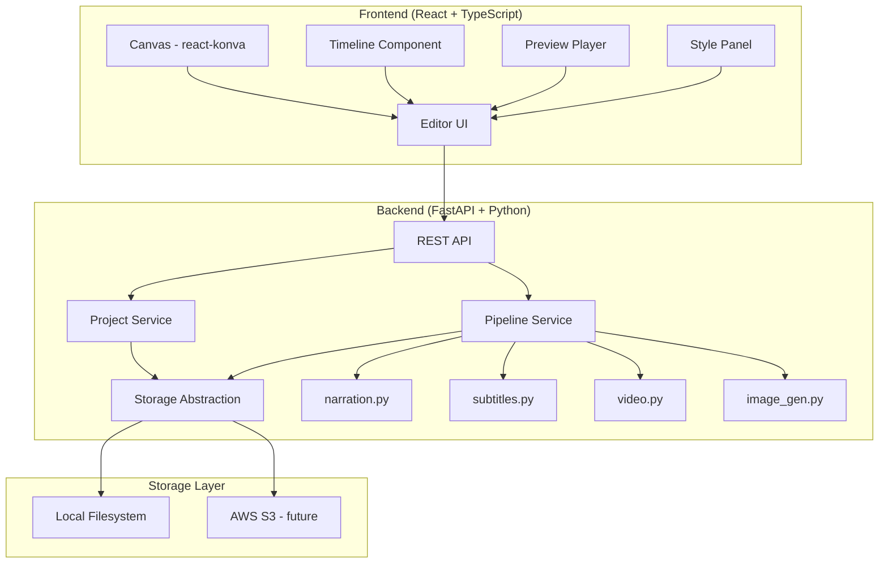
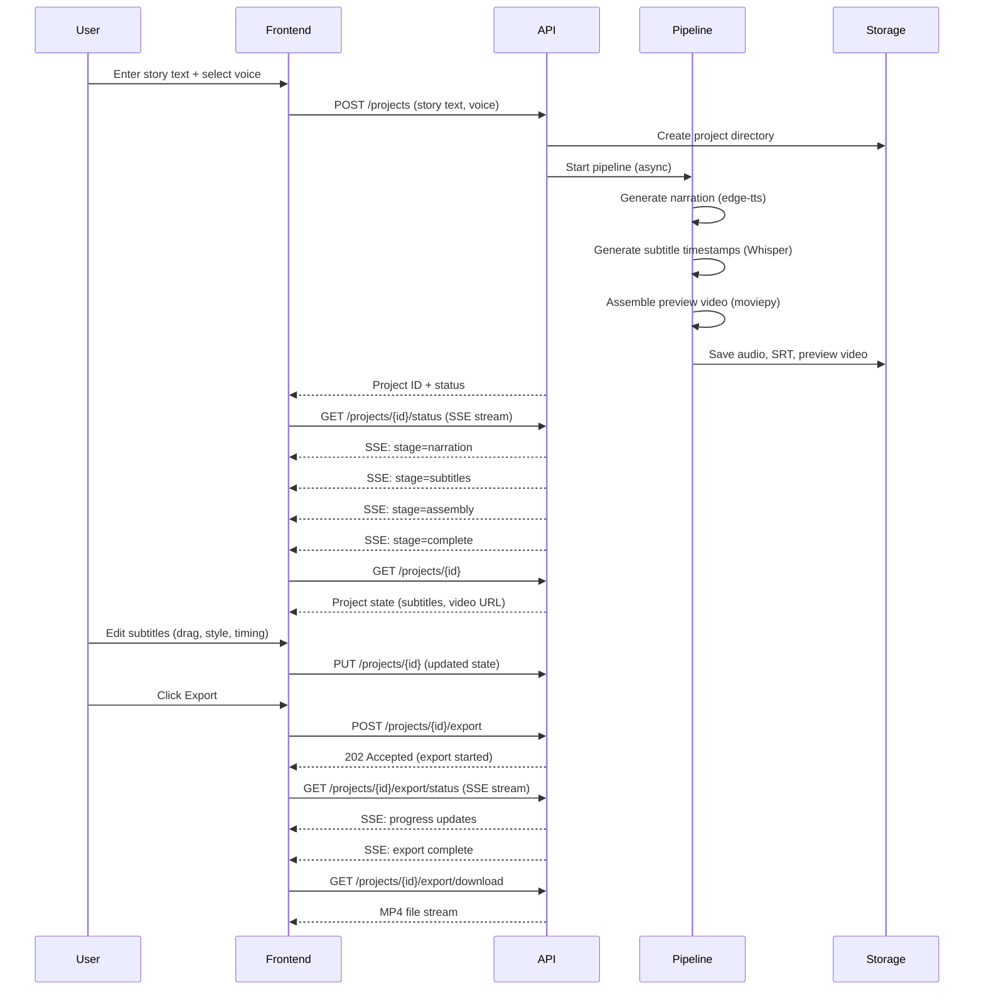

# Design Document: Story Video Editor

## Overview

The Story Video Editor transforms the existing CLI-based Chinese story-to-video pipeline into a web application with a React frontend and a FastAPI (Python) backend. The frontend provides a canvas-based video editor for subtitle manipulation, preview playback, and export controls. The backend wraps the existing pipeline modules (edge-tts, Whisper, moviepy/Pillow) behind a REST API and handles file storage through an abstraction layer that supports local disk or cloud object storage.

### Key Design Decisions

1. **React + TypeScript frontend**: Provides a rich interactive canvas for drag-based subtitle editing, timeline controls, and real-time preview. React's component model maps well to the editor's UI structure (canvas, timeline, style panel, etc.).

2. **FastAPI backend**: Stays in the Python ecosystem, allowing direct reuse of the existing pipeline modules (`narration.py`, `subtitles.py`, `video.py`) with minimal refactoring. FastAPI's async support handles long-running pipeline tasks well via background tasks.

3. **Canvas-based subtitle editing**: HTML5 Canvas (via a library like Konva.js/react-konva) enables drag-to-reposition and visual manipulation of subtitle overlays on the video frame.

4. **Single render model**: The video is rendered exactly once during the initial pipeline run. All subtitle editing (position, style, timing) happens as lightweight Canvas overlays on the frontend — no video re-rendering during editing. A second render only occurs when the user explicitly triggers Export, which bakes all edits into the final MP4.

5. **File storage abstraction**: A storage interface with local and S3 implementations allows seamless transition from local development to AWS deployment.

6. **Project-based state model**: All edits are stored as a JSON project state on the backend, enabling persistence and reload without requiring a database initially (file-based storage, upgradeable to DynamoDB/RDS later).

## Architecture



### Request Flow



## Components and Interfaces

### Backend API Endpoints

| Endpoint | Method | Description |
|---|---|---|
| `/projects` | POST | Create new project, start pipeline |
| `/projects` | GET | List user's projects (returns summaries: id, title, status, createdAt, updatedAt — no subtitle data) |
| `/projects/{id}` | GET | Get full project state |
| `/projects/{id}` | PUT | Update project state (subtitle edits) |
| `/projects/{id}` | DELETE | Delete project and all associated files |
| `/projects/{id}/status` | GET | Stream pipeline progress via SSE |
| `/projects/{id}/export` | POST | Trigger async video export |
| `/projects/{id}/export/status` | GET | Stream export progress via SSE |
| `/projects/{id}/export/download` | GET | Download exported video |
| `/projects/{id}/retry` | POST | Retry pipeline from the failed stage (only valid when status is "error") |
| `/projects/{id}/media/{filename}` | GET | Serve media files (audio, preview video) |
| `/projects/{id}/background` | POST | Upload custom background image |
| `/voices` | GET | List available edge-tts voices |

All project endpoints require authentication. The project owner is set at creation time and only the owner can access, modify, or export the project.

The `/projects/{id}/media/{filename}` endpoint validates that `filename` contains no path traversal characters (`..`, `/`, `\`). Requests with invalid filenames are rejected with 400 Bad Request.

### SSE Connection Lifecycle

Both SSE endpoints (`/projects/{id}/status` and `/projects/{id}/export/status`) follow these rules:

- **On connect**: The server immediately sends the current pipeline/export stage as the first event. This ensures reconnecting clients always catch up to the current state without missing past events.
- **During processing**: The server sends an event each time the stage changes (e.g., narration → subtitles → assembly → complete).
- **Keepalive**: The server sends a comment-only keepalive ping every 15 seconds to prevent proxy/load balancer timeouts.
- **On completion**: The server sends a `complete` event and closes the stream.
- **On error**: The server sends an `error` event with the error message and closes the stream.
- **Client disconnect**: The server detects the closed connection and stops sending events. No cleanup is needed since pipeline processing continues independently.
- **Reconnect after completion**: If a client connects to the SSE endpoint after processing has already finished, the server sends the `complete` (or `error`) event immediately and closes. Alternatively, the client can skip SSE entirely by checking the project state via `GET /projects/{id}` — if `status` is `ready` or `exported`, the `video_url` or `export_url` is already populated.

### Authentication

The backend requires authentication for all users. There is no anonymous access.

- **Local development**: A simple token-based auth using a configurable API key passed via `Authorization: Bearer <token>` header. The key is set via the `API_SECRET_KEY` environment variable. When `AUTH_DISABLED=true`, the server skips token validation and assigns all requests to a fixed dev user identity (`DEV_OWNER_ID`, default `"dev-user"`). If neither `API_SECRET_KEY` nor `AUTH_DISABLED=true` is set, the server refuses to start (fail closed).
- **AWS deployment (future)**: Swap to Amazon Cognito or any JWT-based provider. The middleware validates the JWT and extracts the user ID.

Each project stores an `owner_id` field. The auth middleware extracts the user identity from the request and the project service verifies that the requesting user matches the project owner. Project IDs use UUIDs (not sequential) to prevent enumeration.

### Resource Limits

To prevent disk exhaustion and abuse, the backend enforces configurable limits via environment variables:

- `MAX_PROJECTS_PER_USER` (default: 20) — maximum active projects per user. Creating a project beyond this limit returns 429.
- `MAX_CONCURRENT_PIPELINES_PER_USER` (default: 2) — maximum simultaneous pipeline/export jobs per user. Additional requests return 429 with a retry-after suggestion.
- `MAX_UPLOAD_SIZE_MB` (default: 50) — maximum file upload size for background images and text files.
- `AUTH_DISABLED` (default: false) — must be explicitly set to `true` to disable authentication. When disabled, all requests are assigned to a fixed dev user (`DEV_OWNER_ID`). If `API_SECRET_KEY` is not set and `AUTH_DISABLED` is not `true`, the server refuses to start. This prevents accidental production exposure.

### Backend Components

#### StorageBackend (Abstract Interface)

```python
from abc import ABC, abstractmethod
from typing import AsyncIterator

class StorageBackend(ABC):
    @abstractmethod
    async def save_file(self, project_id: str, filename: str, data: AsyncIterator[bytes]) -> str:
        """Save file from an async byte stream and return its path/URL."""
        ...

    async def save_file_from_path(self, project_id: str, filename: str, source_path: str) -> str:
        """Save file from a local path. Default implementation reads the file and delegates to save_file.
        Note: Uses synchronous file I/O — acceptable since pipeline tasks run in background threads.
        Override in subclasses for async I/O if needed."""
        async def _read_chunks():
            with open(source_path, "rb") as f:
                while chunk := f.read(8192):
                    yield chunk
        return await self.save_file(project_id, filename, _read_chunks())

    @abstractmethod
    async def load_file(self, project_id: str, filename: str) -> AsyncIterator[bytes]:
        """Load file contents as an async byte stream."""
        ...

    @abstractmethod
    async def get_file_url(self, project_id: str, filename: str) -> str:
        """Get a URL/path to serve the file."""
        ...

    @abstractmethod
    async def delete_project(self, project_id: str) -> None:
        """Delete all files for a project."""
        ...
```

#### LocalStorageBackend

Implements `StorageBackend` using the local filesystem. Files stored under `./data/projects/{project_id}/`.

#### S3StorageBackend (Future)

Implements `StorageBackend` using boto3 for AWS S3. Files stored under `s3://{bucket}/projects/{project_id}/`.

#### PipelineService

Wraps the existing pipeline modules. Orchestrates the text → narration → subtitles → video flow. Accepts a project ID and configuration, reads/writes through `StorageBackend`.

```python
class PipelineService:
    def __init__(self, storage: StorageBackend):
        self.storage = storage

    async def run_pipeline(self, project_id: str, story: str, voice: str) -> None:
        """Run the full pipeline: narration → subtitles → preview video."""
        ...

    async def export_video(self, project_id: str, project_state: ProjectState) -> str:
        """Re-render video with edited subtitle positions/styles/timings."""
        ...
```

#### ProjectService

Manages project CRUD operations. Stores project state as JSON files via `StorageBackend`.

```python
class ProjectService:
    def __init__(self, storage: StorageBackend):
        self.storage = storage

    async def create_project(self, story: str, voice: str) -> Project:
        ...

    async def get_project(self, project_id: str) -> Project:
        ...

    async def update_project(self, project_id: str, state: ProjectState) -> Project:
        ...
```

### Frontend Components

#### EditorPage
Top-level page component. Manages project state, coordinates child components.

#### VideoCanvas (react-konva)
Renders the video frame with subtitle overlays. Handles drag-to-reposition for subtitles. Displays the current frame based on playback position.

**Known limitation**: The Canvas renders subtitles using browser text rendering (Konva.js), while the export uses Pillow. Font metrics, text wrapping, and outline rendering will differ slightly between preview and export. The preview is approximate — the exported video is the source of truth. A future enhancement could have the backend generate preview frames as images for pixel-accurate preview.

#### PreviewPlayer
HTML5 video/audio playback with custom controls. Synchronizes playback position with the Canvas and Timeline. Provides play/pause, seek, and timestamp display.

#### Timeline
Horizontal timeline showing subtitle segments as draggable/resizable blocks. Allows adjusting subtitle start/end times by dragging block edges.

#### SubtitleStylePanel
Form controls for editing the selected subtitle's font size, font color, outline color, and font family. Changes apply in real time to the Canvas.

#### VoiceSelector
Dropdown populated from the `/voices` endpoint. Shown during project creation.

#### BackgroundUploader
File upload component for custom background images. Shown in a settings/sidebar panel.


## Data Models

### Project

```typescript
// Frontend model
interface Project {
  id: string;
  title: string;
  storyText: string;
  voice: string;
  status: "pending" | "processing" | "ready" | "exporting" | "exported" | "error";
  version: number; // Optimistic concurrency control
  pipelineProgress: PipelineProgress;
  subtitles: SubtitleSegment[];
  backgroundImage: string | null; // URL or null for default black
  videoUrl: string | null;
  audioUrl: string | null;
  audioDuration: number | null; // seconds, set after narration completes
  exportUrl: string | null;
  createdAt: string;
  updatedAt: string;
}

interface PipelineProgress {
  stage: "narration" | "subtitles" | "assembly" | "complete" | "error";
  message: string;
}
interface SubtitleSegment {
  id: string;
  text: string;
  startTime: number;  // seconds
  endTime: number;    // seconds
  position: Position;
  style: SubtitleStyle;
}

interface Position {
  x: number; // 0-1 normalized (fraction of video width)
  y: number; // 0-1 normalized (fraction of video height)
}

interface SubtitleStyle {
  fontSize: number;       // normalized (fraction of video height, e.g. 0.047 ≈ 48px at 1024h)
  fontColor: string;      // hex color
  outlineColor: string;   // hex color
  fontFamily: string;     // font name
}
```

```python
# Backend model (Pydantic)
from pydantic import BaseModel

from typing import Literal

class Position(BaseModel):
    x: float  # 0-1 normalized
    y: float  # 0-1 normalized

class SubtitleStyle(BaseModel):
    font_size: float = 0.047  # normalized (fraction of video height, ~48px at 1024h)
    font_color: str = "#FFFFFF"
    outline_color: str = "#000000"
    font_family: str = "Noto Sans CJK SC"  # cross-platform CJK font; fallback chain in renderer

class SubtitleSegment(BaseModel):
    id: str
    text: str
    start_time: float
    end_time: float
    position: Position
    style: SubtitleStyle

class PipelineProgress(BaseModel):
    stage: Literal["narration", "subtitles", "assembly", "complete", "error"]
    message: str

class ProjectState(BaseModel):
    id: str
    owner_id: str  # User identity from auth
    title: str
    story_text: str
    voice: str = "zh-CN-XiaoxiaoNeural"
    status: Literal["pending", "processing", "ready", "exporting", "exported", "error"] = "pending"
    version: int = 1  # Optimistic concurrency control
    pipeline_progress: PipelineProgress
    subtitles: list[SubtitleSegment] = []
    background_image: str | None = None
    video_url: str | None = None
    audio_url: str | None = None
    audio_duration: float | None = None  # seconds, set after narration completes
    export_url: str | None = None
    created_at: str
    updated_at: str
```

### Subtitle Position Normalization

Positions are stored as normalized values (0.0 to 1.0) representing fractions of the video dimensions. Font size is also normalized as a fraction of video height (e.g., 0.047 ≈ 48px at 1024px height). This ensures all spatial values are resolution-independent. The frontend converts between pixel coordinates and normalized values when rendering on the Canvas and when sending updates to the backend. The export engine converts normalized values to absolute pixels using the target video resolution (1792×1024).

Constraint: positions are clamped so that the subtitle bounding box remains fully within the frame. The frontend calculates the bounding box based on font size and text length, then clamps `x` and `y` accordingly before sending to the backend.

### Optimistic Concurrency Control

The project state includes a `version` field (integer, starting at 1). On every PUT request, the client must include the current version. The backend checks that the submitted version matches the stored version. If they match, the update proceeds and the version is incremented. If they don't match (another update happened in between), the backend returns a 409 Conflict error. The client should then reload the latest state and retry or merge.

### Subtitle Overlap Handling

Subtitles use a half-open time interval convention: a subtitle is visible when `start_time <= T < end_time`. Both frontend and backend must use this same convention to ensure consistent behavior between preview and export.

Subtitles may overlap in time. When two or more subtitles are visible simultaneously:
- All overlapping subtitles are rendered on the Canvas and in the export
- Z-order follows the subtitle array index — later subtitles in the list render on top
- Spatial overlap is allowed — users are responsible for positioning subtitles to avoid visual collision
- The Timeline UI displays overlapping segments as stacked rows so the overlap is visible
- No validation prevents temporal overlap — this is intentional to support multi-line subtitle scenarios

### Subtitle Timing Validation

The backend validates subtitle timing on every update:
- `start_time < end_time` for each segment (rejects with 422 if violated)
- `0 <= start_time` and `end_time <= audio_duration` when `audio_duration` is known (rejects with 422 if out of range)

If `audio_duration` is not yet set (pipeline still running), the duration bound check is skipped.

### Default Subtitle Initialization

When the pipeline generates subtitles from Whisper, each segment is initialized with:
- `position`: `{x: 0.5, y: 0.85}` (centered, near bottom — matching current behavior)
- `style`: default values (0.047 normalized font size ≈ 48px at 1024h, white text, black outline, Noto Sans CJK SC font with PingFang fallback on macOS)
- `id`: UUID generated at creation time

### Video Export with Edits

The export process modifies the existing `video.py` rendering to accept subtitle positions and styles from the project state rather than using hardcoded values. The `_render_text_frame` function is extended to accept per-subtitle position and style parameters.

### AI Image Generation (Future)

The image generation interface is defined but not implemented. A placeholder `ImageGenerationBackend` abstract class mirrors the `StorageBackend` pattern:

```python
class ImageGenerationBackend(ABC):
    @abstractmethod
    async def generate_single(self, prompt: str) -> bytes:
        """Generate a single image from a text prompt."""
        ...

    @abstractmethod
    async def generate_sectioned(self, prompts: list[str]) -> list[bytes]:
        """Generate images for multiple story sections."""
        ...
```

The Editor UI shows the option but displays a message indicating an API key is required. When a provider is integrated, only the concrete implementation needs to be added.


## Correctness Properties

*A property is a characteristic or behavior that should hold true across all valid executions of a system — essentially, a formal statement about what the system should do. Properties serve as the bridge between human-readable specifications and machine-verifiable correctness guarantees.*

### Property 1: Whitespace text rejection

*For any* string composed entirely of whitespace characters (spaces, tabs, newlines, or empty string), submitting it to the project creation API should be rejected with a validation error, and no project should be created.

**Validates: Requirements 1.3**

### Property 2: Visible subtitles at time T

*For any* list of subtitle segments and any time value T, the set of subtitles visible at time T should be exactly those segments where `start_time <= T < end_time`. No subtitle outside this range should be visible, and no subtitle within this range should be hidden.

**Validates: Requirements 2.3**

### Property 3: Position clamping within bounds

*For any* subtitle position (x, y) and any subtitle bounding box dimensions (width, height as fractions of the video frame), the clamped position should ensure the entire bounding box remains within the normalized bounds [0, 1] on both axes. Specifically, `0 <= clamped_x` and `clamped_x + box_width <= 1`, and similarly for y.

**Validates: Requirements 3.2**

### Property 4: Project state save/load round trip

*For any* valid project state containing arbitrary subtitle positions, styles, and timings, saving the state to the backend and then loading it back should produce an equivalent project state. All subtitle positions, styles, timing values, and background image references should be preserved exactly.

**Validates: Requirements 3.3, 4.3, 5.1, 10.1, 10.2**

### Property 5: Subtitle timing validation

*For any* pair of (start_time, end_time) values, a subtitle timing update should succeed if and only if `start_time < end_time`. When `start_time >= end_time`, the update should be rejected with a validation error and the subtitle should remain unchanged.

**Validates: Requirements 5.2, 5.3**

### Property 6: Project creation for valid text

*For any* non-empty, non-whitespace-only story string, submitting it to the project creation API should successfully create a project with a valid unique ID and a status of "processing".

**Validates: Requirements 1.1**

### Property 7: Voice selection propagation

*For any* valid voice identifier from the available voices list, when that voice is specified during project creation, the pipeline should receive and use that exact voice identifier for narration generation.

**Validates: Requirements 8.2**

### Property 8: Project ID uniqueness

*For any* number of sequentially created projects, all assigned project IDs should be distinct. No two projects should share the same identifier.

**Validates: Requirements 10.3**

## Error Handling

### Backend Error Handling

| Error Scenario | HTTP Status | Response |
|---|---|---|
| Empty/whitespace story text | 422 | Validation error with message |
| Path traversal in media filename | 400 | Invalid filename |
| Unauthorized (missing/invalid token) | 401 | Authentication required |
| Forbidden (not project owner) | 403 | Access denied |
| Invalid subtitle timing (start >= end) | 422 | Validation error with message |
| Version conflict (optimistic concurrency) | 409 | Conflict; client should reload and retry |
| Project not found | 404 | Project ID not found message |
| Pipeline failure (edge-tts, Whisper) | 500 | Error details; project status set to "error" |
| Invalid file upload (wrong format) | 422 | Unsupported file format message |
| Export failure (moviepy) | 500 | Error details; project status set to "error" |
| Storage backend failure | 503 | Service unavailable message |
| Max projects per user exceeded | 429 | Too many projects; delete existing ones |
| Upload size exceeds limit | 413 | File too large |

### Pipeline Error Recovery

When a pipeline stage fails:
1. The project status is set to "error"
2. The `pipeline_progress` field records which stage failed and the error message
3. Partial artifacts (e.g., narration audio if subtitles failed) are preserved
4. The user can retry via `POST /projects/{id}/retry`, which resumes the pipeline from the failed stage using any preserved artifacts
5. The frontend displays the error with the failed stage name, message, and a retry button

Retry behavior by failed stage:
- **narration failed**: Retry re-runs narration from scratch (no partial audio)
- **subtitles failed**: Retry re-runs Whisper using the preserved narration audio
- **assembly failed**: Retry re-runs video assembly using preserved audio and subtitle data
- Retry is only valid when project status is "error" — returns 422 otherwise
- Retry resets status to "processing" and resumes the SSE stream

### Frontend Error Handling

- API request failures display a toast notification with the error message
- Network disconnection shows a connection status indicator
- File upload validation (size limits, format checks) happens client-side before sending to the backend
- Invalid drag positions are silently clamped (no error shown, just constrained)

## Testing Strategy

### Testing Framework

- **Backend**: pytest with `hypothesis` for property-based testing, `httpx` for async API testing
- **Frontend**: Vitest with `fast-check` for property-based testing, React Testing Library for component tests

### Property-Based Tests

Each correctness property from the design document is implemented as a single property-based test with a minimum of 100 iterations. Tests are tagged with the format:

```
Feature: story-video-editor, Property N: [property title]
```

Property tests focus on:
- Input validation logic (Properties 1, 5, 6)
- Spatial/temporal query logic (Properties 2, 3)
- Data persistence round trips (Property 4)
- Identity generation (Property 8)
- Configuration propagation (Property 7)

### Unit Tests

Unit tests complement property tests by covering:
- Specific examples and edge cases (e.g., default voice selection, default black background)
- API endpoint integration (e.g., export produces valid MP4)
- Component rendering (e.g., CJK font list contains expected fonts)
- Error conditions (e.g., pipeline failure handling)

### Test Organization

Tests are co-located with the code they test:
- `backend/tests/` — Python backend tests (pytest + hypothesis)
- `frontend/src/__tests__/` — TypeScript frontend tests (vitest + fast-check)

Property-based tests and unit tests live in the same test files, grouped by the component they validate.
