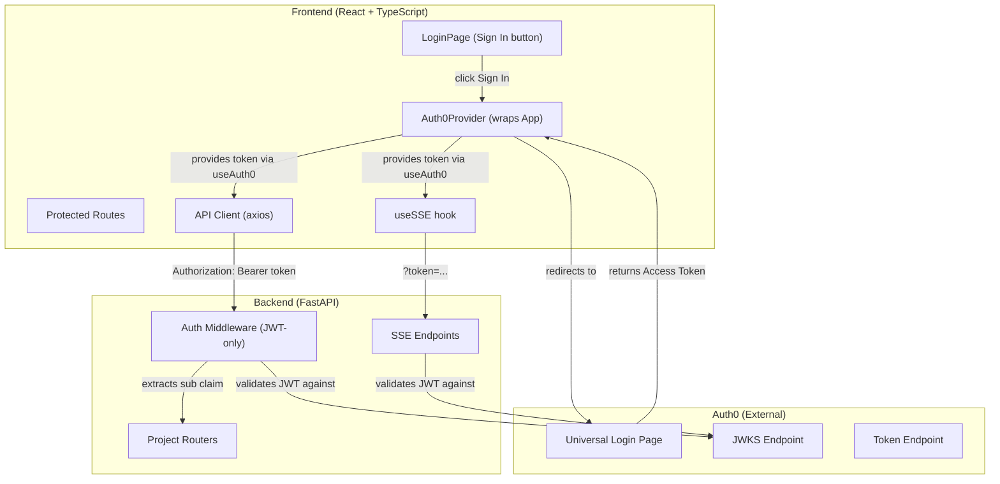
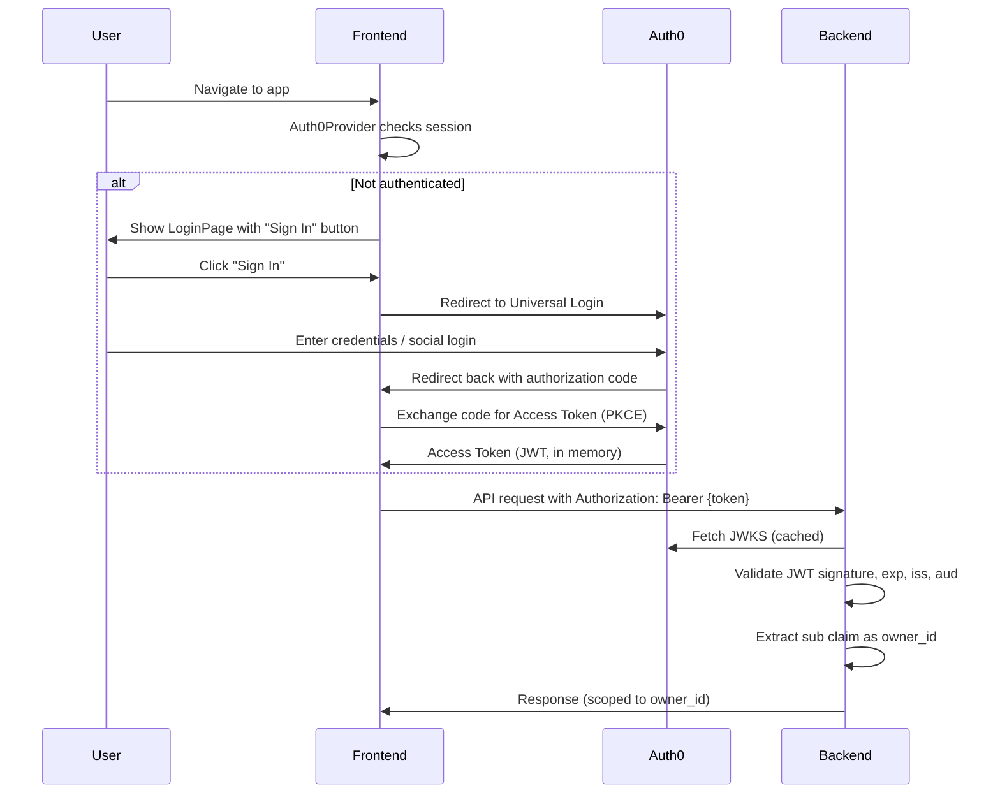

# Design Document: User Accounts (Auth0-Only Authentication)

## Overview

This feature replaces the existing dual-mode authentication system (simple API_SECRET_KEY token + optional JWT) with Auth0 as the sole authentication mechanism across all environments. The frontend's custom LoginPage and localStorage-based token management are replaced with the `@auth0/auth0-react` SDK, which handles login/signup via Auth0 Universal Login, in-memory token storage, and silent token refresh. The backend's auth middleware is simplified to JWT-only validation against Auth0's JWKS endpoint — the simple token fallback, `API_SECRET_KEY`, `DEV_OWNER_ID`, and `AUTH_DISABLED` config are all removed.

### Key Design Decisions

1. **Auth0 as sole auth provider**: Eliminates the complexity of maintaining two auth paths (simple token + JWT). Every environment — local dev included — uses a real Auth0 tenant. This removes an entire class of "works in dev, breaks in prod" bugs.

2. **`@auth0/auth0-react` SDK**: Provides `Auth0Provider`, `useAuth0()` hook, and `getAccessTokenSilently()` out of the box. Tokens are stored in memory (not localStorage), and refresh is handled automatically. This replaces the custom `auth.ts` and `LoginPage`.

3. **Config derived from `AUTH0_DOMAIN`**: The backend derives `JWT_ISSUER` as `https://{AUTH0_DOMAIN}/` and `JWT_JWKS_URI` as `https://{AUTH0_DOMAIN}/.well-known/jwks.json` from a single `AUTH0_DOMAIN` env var. This reduces misconfiguration risk.

4. **Fail-closed startup**: If `AUTH0_DOMAIN` is not set, the backend refuses to start. No fallback, no silent degradation.

5. **Existing JWT validation code reused**: The `decode_jwt`, `_get_signing_key`, and JWKS caching logic in `backend/auth/middleware.py` already work correctly for Auth0 JWTs. The only change is removing the simple-token fallback branch from `get_owner_id`.

6. **Test strategy preserved**: Tests that don't care about auth continue to override `get_owner_id` to return a fixed owner_id. Auth-specific tests use test RSA keypairs and mock JWKS, which the existing `test_auth.py` already does.

## Architecture



### Authentication Flow



## Components and Interfaces

### Backend Changes

#### `backend/config.py` — Simplified Settings

Remove: `API_SECRET_KEY`, `DEV_OWNER_ID`, `JWT_ISSUER`, `JWT_JWKS_URI`
Add: `AUTH0_DOMAIN`, `AUTH0_AUDIENCE`
Derive: `JWT_ISSUER` and `JWT_JWKS_URI` from `AUTH0_DOMAIN` as computed properties

```python
class Settings:
    AUTH0_DOMAIN: str | None = os.getenv("AUTH0_DOMAIN")
    AUTH0_AUDIENCE: str | None = os.getenv("AUTH0_AUDIENCE")
    MAX_PROJECTS_PER_USER: int = int(os.getenv("MAX_PROJECTS_PER_USER", "20"))
    MAX_CONCURRENT_PIPELINES_PER_USER: int = int(os.getenv("MAX_CONCURRENT_PIPELINES_PER_USER", "2"))
    MAX_UPLOAD_SIZE_MB: int = int(os.getenv("MAX_UPLOAD_SIZE_MB", "50"))
    CORS_ORIGINS: list[str] = os.getenv("CORS_ORIGINS", "*").split(",")
    DATA_DIR: str = os.getenv("DATA_DIR", "./data")

    @property
    def JWT_ISSUER(self) -> str | None:
        if self.AUTH0_DOMAIN:
            return f"https://{self.AUTH0_DOMAIN}/"
        return None

    @property
    def JWT_JWKS_URI(self) -> str | None:
        if self.AUTH0_DOMAIN:
            return f"https://{self.AUTH0_DOMAIN}/.well-known/jwks.json"
        return None
```

#### `backend/main.py` — Startup Check

Replace the `_check_auth_config()` function to check `AUTH0_DOMAIN` instead of `API_SECRET_KEY`/`JWT_ISSUER`:

```python
def _check_auth_config() -> None:
    if not settings.AUTH0_DOMAIN:
        print(
            "ERROR: AUTH0_DOMAIN is not set. "
            "Set AUTH0_DOMAIN to your Auth0 tenant domain (e.g., myapp-dev.us.auth0.com).",
            file=sys.stderr,
        )
        sys.exit(1)
```

#### `backend/auth/middleware.py` — JWT-Only `get_owner_id`

Remove the simple-token fallback branch entirely. The function becomes:

```python
async def get_owner_id(
    request: Request,
    credentials: HTTPAuthorizationCredentials | None = Depends(_bearer_scheme),
    app_settings: Settings = Depends(get_settings),
) -> str:
    if credentials is None:
        query_token = request.query_params.get("token")
        if query_token:
            credentials = HTTPAuthorizationCredentials(
                scheme="Bearer", credentials=query_token
            )
        else:
            raise HTTPException(
                status_code=status.HTTP_401_UNAUTHORIZED,
                detail="Authentication required",
                headers={"WWW-Authenticate": "Bearer"},
            )

    payload = decode_jwt(credentials.credentials, app_settings)
    sub = payload.get("sub")
    if not sub:
        raise HTTPException(
            status_code=status.HTTP_401_UNAUTHORIZED,
            detail="Token missing sub claim",
            headers={"WWW-Authenticate": "Bearer"},
        )
    return sub
```

The `decode_jwt`, `_get_signing_key`, JWKS caching, and `verify_project_ownership` functions remain unchanged.

Remove: `import secrets`, the `secrets.compare_digest` branch, `X-Owner-Id` header reading.

### Frontend Changes

#### New dependency: `@auth0/auth0-react`

Add to `frontend/package.json`:
```json
"@auth0/auth0-react": "^2.2.4"
```

#### `frontend/src/App.tsx` — Auth0Provider Wrapper

Replace the custom `isAuthenticated()`/`clearToken()` logic with Auth0Provider and `useAuth0()`:

```tsx
import { Auth0Provider, useAuth0 } from "@auth0/auth0-react";

function App() {
  const domain = import.meta.env.VITE_AUTH0_DOMAIN;
  const clientId = import.meta.env.VITE_AUTH0_CLIENT_ID;
  const audience = import.meta.env.VITE_AUTH0_AUDIENCE;

  if (!domain || !clientId || !audience) {
    return <div>Error: Missing Auth0 configuration.</div>;
  }

  return (
    <Auth0Provider
      domain={domain}
      clientId={clientId}
      authorizationParams={{
        redirect_uri: window.location.origin,
        audience,
      }}
    >
      <ErrorBoundary>
        <ToastProvider>
          <AuthGate />
        </ToastProvider>
      </ErrorBoundary>
    </Auth0Provider>
  );
}

function AuthGate() {
  const { isAuthenticated, isLoading, logout } = useAuth0();

  if (isLoading) return <LoadingIndicator />;
  if (!isAuthenticated) return <LoginPage />;

  return (
    <>
      <ConnectionStatus />
      <BrowserRouter>
        <SignOutButton onSignOut={() => logout({ logoutParams: { returnTo: window.location.origin } })} />
        <Routes>
          <Route path="/" element={<CreateProjectPage />} />
          <Route path="/projects" element={<ProjectListPage />} />
          <Route path="/projects/:id" element={<EditorPage />} />
        </Routes>
      </BrowserRouter>
    </>
  );
}
```

#### `frontend/src/api/client.ts` — Token from Auth0 SDK

Replace the localStorage token injection with a setup function that receives `getAccessTokenSilently` from the Auth0 hook:

```typescript
let _getToken: (() => Promise<string>) | null = null;

export function configureAuth(getToken: () => Promise<string>) {
  _getToken = getToken;
}

// Request interceptor uses _getToken instead of localStorage
apiClient.interceptors.request.use(async (config) => {
  if (_getToken) {
    const token = await _getToken();
    config.headers.Authorization = `Bearer ${token}`;
  }
  // ... snake_case conversion unchanged
  return config;
});

/** Get a fresh token for SSE URLs that need ?token= query param. */
export async function getApiToken(): Promise<string> {
  if (_getToken) return _getToken();
  return "";
}
```

The `AuthGate` component calls `configureAuth(getAccessTokenSilently)` on mount.

#### SSE Components — Async Token Retrieval

`PipelineProgress` and `ExportPanel` currently call `getApiToken()` synchronously. Since `getAccessTokenSilently` is async, these components need to await the token before constructing the SSE URL:

```tsx
// In PipelineProgress and ExportPanel:
const [sseUrl, setSseUrl] = useState<string | null>(null);

useEffect(() => {
  getApiToken().then(token => {
    setSseUrl(`${API_BASE}/projects/${projectId}/status${token ? `?token=${token}` : ""}`);
  });
}, [projectId]);
```

#### Files to Delete

- `frontend/src/auth.ts` — replaced by Auth0 SDK
- `frontend/src/pages/LoginPage.tsx` — replaced by new LoginPage that just calls `loginWithRedirect()`

The new LoginPage is a simple component:

```tsx
import { useAuth0 } from "@auth0/auth0-react";

export function LoginPage() {
  const { loginWithRedirect } = useAuth0();
  return (
    <div>
      <h1>Story Video Editor</h1>
      <p>Sign in to continue.</p>
      <button onClick={() => loginWithRedirect()}>Sign In</button>
    </div>
  );
}
```

### Test Changes

#### `backend/tests/conftest.py`

Remove the `API_SECRET_KEY` env var setup. Replace with `AUTH0_DOMAIN`:

```python
def pytest_configure(config):
    config.option.asyncio_mode = "auto"
    os.environ.setdefault("AUTH0_DOMAIN", "test-auth0.example.com")
    os.environ.setdefault("AUTH0_AUDIENCE", "test-audience")
```

#### `backend/tests/test_auth.py`

- Remove `TestTokenValidation` class (simple token mode tests)
- Keep `TestJWTValidation` class — update settings to use `AUTH0_DOMAIN`/`AUTH0_AUDIENCE` instead of `JWT_ISSUER`/`JWT_AUDIENCE`/`JWT_JWKS_URI`
- Keep `TestOwnershipVerification` unchanged
- Add test for startup failure when `AUTH0_DOMAIN` is not set

#### Other test files

Tests that use `get_owner_id` override (e.g., `test_projects_router.py`, `test_project_service.py`) continue to work unchanged — they override the dependency to return a fixed owner_id and never touch JWT validation.

## Data Models

### Environment Variables

#### Backend

| Variable | Required | Description |
|---|---|---|
| `AUTH0_DOMAIN` | Yes | Auth0 tenant domain (e.g., `myapp-dev.us.auth0.com`) |
| `AUTH0_AUDIENCE` | Yes | Auth0 API audience identifier |
| `MAX_PROJECTS_PER_USER` | No | Default: 20 |
| `MAX_CONCURRENT_PIPELINES_PER_USER` | No | Default: 2 |
| `MAX_UPLOAD_SIZE_MB` | No | Default: 50 |
| `CORS_ORIGINS` | No | Default: `*` |
| `DATA_DIR` | No | Default: `./data` |

Removed: `API_SECRET_KEY`, `DEV_OWNER_ID`, `AUTH_DISABLED`, `JWT_ISSUER`, `JWT_JWKS_URI`, `JWT_AUDIENCE`

#### Frontend

| Variable | Required | Description |
|---|---|---|
| `VITE_API_URL` | No | Default: `http://localhost:8000` |
| `VITE_AUTH0_DOMAIN` | Yes | Auth0 tenant domain |
| `VITE_AUTH0_CLIENT_ID` | Yes | Auth0 application client ID |
| `VITE_AUTH0_AUDIENCE` | Yes | Auth0 API audience identifier |

### Settings Model (Backend)

```python
class Settings:
    AUTH0_DOMAIN: str | None       # e.g., "myapp-dev.us.auth0.com"
    AUTH0_AUDIENCE: str | None     # e.g., "https://api.myapp.com"
    # JWT_ISSUER and JWT_JWKS_URI are derived properties, not stored
```

### Token Flow Model

```
Auth0 Access Token (JWT):
  header: { alg: "RS256", kid: "<key-id>" }
  payload: {
    iss: "https://{AUTH0_DOMAIN}/",
    sub: "auth0|abc123" | "google-oauth2|123456",  // → owner_id
    aud: "{AUTH0_AUDIENCE}",
    exp: <timestamp>,
    iat: <timestamp>
  }
```

The `sub` claim value becomes the `owner_id` for all project operations. No mapping or transformation is applied — the raw Auth0 sub claim is used directly.


## Correctness Properties

*A property is a characteristic or behavior that should hold true across all valid executions of a system — essentially, a formal statement about what the system should do. Properties serve as the bridge between human-readable specifications and machine-verifiable correctness guarantees.*

### Property 1: API requests include Bearer token

*For any* API request made through the axios client when a token provider is configured, the outgoing request's `Authorization` header should be set to `Bearer {token}` where `{token}` is the value returned by the configured token provider.

**Validates: Requirements 3.1, 3.2**

### Property 2: Invalid JWT claims are rejected

*For any* JWT where at least one of the following is invalid — signature (signed by wrong key), expiration (in the past), issuer (doesn't match `https://{AUTH0_DOMAIN}/`), or audience (doesn't match `AUTH0_AUDIENCE`) — the auth middleware should reject the request with a 401 status code.

**Validates: Requirements 4.3, 4.5, 4.6, 4.7**

### Property 3: Sub claim extraction as owner_id

*For any* valid JWT containing a `sub` claim, the auth middleware should extract the `sub` claim value and return it as the `owner_id`. The returned `owner_id` should be exactly equal to the `sub` claim string in the token payload.

**Validates: Requirements 4.4, 6.1, 6.2**

### Property 4: AUTH0_DOMAIN derivation

*For any* non-empty `AUTH0_DOMAIN` string, the Settings class should derive `JWT_ISSUER` as `https://{AUTH0_DOMAIN}/` and `JWT_JWKS_URI` as `https://{AUTH0_DOMAIN}/.well-known/jwks.json`. Both derived values should contain the original domain string unchanged.

**Validates: Requirements 5.2, 5.3**

### Property 5: Auth0 sub format acceptance

*For any* JWT containing a `sub` claim in a valid Auth0 user identifier format (e.g., `auth0|{id}`, `google-oauth2|{id}`, `facebook|{id}`, `github|{id}`), the auth middleware should accept the token and return the full `sub` string as the `owner_id` without modification or truncation.

**Validates: Requirements 6.3**

## Error Handling

### Backend Error Responses

| Error Scenario | HTTP Status | Response Detail |
|---|---|---|
| Missing Authorization header and no `?token=` param | 401 | "Authentication required" |
| Expired JWT | 401 | "Token has expired" |
| Invalid JWT signature | 401 | "Invalid authentication token" |
| Wrong issuer | 401 | "Invalid token issuer" |
| Wrong audience | 401 | "Invalid token audience" |
| Missing `kid` in JWT header | 401 | "Token missing kid header" |
| `kid` not found in JWKS | 401 | "Signing key not found" |
| Missing `sub` claim in valid JWT | 401 | "Token missing sub claim" |
| Malformed/garbage token | 401 | "Invalid token header" |
| Project not owned by requesting user | 403 | "Access denied: you do not own this project" |
| `AUTH0_DOMAIN` not set at startup | Exit 1 | stderr: "AUTH0_DOMAIN is not set..." |

### Frontend Error Handling

- 401 responses from the API trigger a redirect to the LoginPage (clear Auth0 session, re-authenticate)
- Missing `VITE_AUTH0_DOMAIN`, `VITE_AUTH0_CLIENT_ID`, or `VITE_AUTH0_AUDIENCE` displays a configuration error message instead of the app
- Auth0 SDK loading state shows a loading indicator (prevents flash of LoginPage during token refresh)
- Silent token refresh failure causes `isAuthenticated` to become false, which shows the LoginPage

## Testing Strategy

### Testing Framework

- **Backend**: pytest with `hypothesis` for property-based testing, `httpx`/`TestClient` for API testing
- **Frontend**: Vitest with `fast-check` for property-based testing, React Testing Library for component tests

### Property-Based Tests

Each correctness property is implemented as a single property-based test with a minimum of 100 iterations. Tests are tagged with:

```
Feature: user-accounts, Property N: [property title]
```

- **Property 1** (API token inclusion): Use `fast-check` to generate random request configs, verify the axios interceptor adds the Authorization header with the token from the configured provider.
- **Property 2** (Invalid JWT rejection): Use `hypothesis` to generate JWTs with randomized invalid claims (wrong key, expired, wrong issuer, wrong audience). Sign with test RSA keypairs, mock JWKS endpoint. Verify all are rejected with 401.
- **Property 3** (Sub claim extraction): Use `hypothesis` to generate random `sub` claim strings, create valid JWTs with test RSA keypairs, verify the middleware returns the exact `sub` value as `owner_id`.
- **Property 4** (AUTH0_DOMAIN derivation): Use `hypothesis` to generate random domain strings, verify `JWT_ISSUER` and `JWT_JWKS_URI` are correctly derived.
- **Property 5** (Auth0 sub format acceptance): Use `hypothesis` to generate `sub` claims in various Auth0 provider formats (`auth0|`, `google-oauth2|`, etc.), create valid JWTs, verify the middleware accepts them and returns the full `sub` string.

### Unit Tests

Unit tests complement property tests:

- **Startup check**: Verify the app refuses to start when `AUTH0_DOMAIN` is not set (Requirement 9.6)
- **JWKS caching**: Verify that multiple JWT validations reuse cached JWKS (Requirement 4.2)
- **SSE token passing**: Verify that `?token=` query param is accepted as auth for SSE endpoints (Requirement 3.4)
- **Missing token**: Verify 401 when no Authorization header or `?token=` param is present
- **Frontend LoginPage**: Verify "Sign In" button calls `loginWithRedirect()` (Requirement 2.2)
- **Frontend AuthGate**: Verify loading indicator when `isLoading` is true (Requirement 2.6)
- **Frontend config error**: Verify error message when Auth0 env vars are missing (Requirement 7.4)

### Test Organization

- `backend/tests/test_auth.py` — JWT validation property tests + unit tests (updated from current dual-mode tests)
- `backend/tests/conftest.py` — Sets `AUTH0_DOMAIN` and `AUTH0_AUDIENCE` env vars for test suite
- `frontend/src/__tests__/` — Frontend auth component tests

### Test Configuration

Backend tests that don't test auth directly continue to override `get_owner_id` dependency to return a fixed owner_id, bypassing JWT validation entirely. Only `test_auth.py` exercises the actual JWT validation path using test RSA keypairs and mocked JWKS.
